# preperation4interview

### 2019前端趋势
* https://www.infoq.cn/article/K_RFbwfff5MugJXixYDQ

### 笔试
* https://www.jianshu.com/p/35a027c7e4d9

### 前端面试：
* https://github.com/azl397985856/fe-interview（或者https://lucifer.ren/fe-interview/#/）

### ReactNative原理:
- ui跨端通过虚拟dom（ui描述json文件），不同平台拿到标准描述文件去实现各个平台ui，从而实现跨端

- 通讯则通过javascriptcore，或jscore.so实现与原生平台通讯
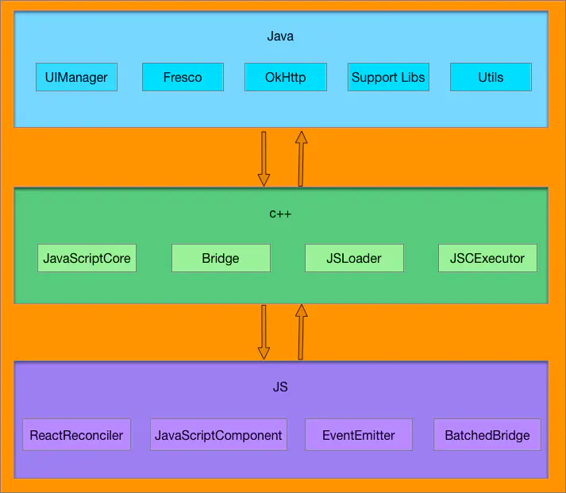

* https://www.jianshu.com/p/038975d7f22d
* https://blog.cnbang.net/tech/2698/
* [react native三端同构](https://www.ibm.com/developerworks/cn/web/wa-universal-react-native/index.html)

### web components
custom element, shodaw dom, template模板（x-tag，polymer），小程序貌似使用web component标准
可重用，非侵入式，可维护，语义化组件
* https://www.w3cplus.com/web-components/why-web-components-are-important.html
* https://developer.mozilla.org/zh-CN/docs/Web/Web_Components
* http://taobaofed.org/blog/2018/10/31/a-tag/

### 小程序原理：
 

- 不允许使用iframe、不允许a直接外跳到其他在线网页、不允许开发者触碰DOM、不允许使用某些未知的危险API等
- 小程序的逻辑层和渲染层是分开的，逻辑层运行在 JSCore 中，并没有一个完整浏览器对象，因而缺少相关的DOM API和BOM API。这一区别导致了前端开发非常熟悉的一些库，例如 jQuery、 Zepto 等，在小程序中是无法运行的。同时 JSCore 的环境同 NodeJS 环境也是不尽相同，所以一些 NPM 的包在小程序中也是无法运行的。
- 小程序开发者工具	NWJS(逻辑层)	Chrome WebView(渲染层)
-  WXML 模板和 WXSS 样式工作在渲染层，JS 脚本工作在逻辑层。
-  一个小程序存在多个界面，所以渲染层存在多个WebView线程，这两个线程的通信会经由微信客户端（下文中也会采用Native来代指微信客户端）做中转，逻辑层发送网络请求也经由Native转发，小程序的通信模型下图所示。
- 双线程本质就是为了隔离用户的代码，这样更安全可控，沙箱有iframe或webworker，或者jscore创建线程
- 网络请求全部由native托管
- https://juejin.im/post/5afd136551882542682e6ad7
- https://github.com/Lmagic16/blog/issues/31

#### 小程序优缺点
- 优点
  - 无需下载安装，用完即走
  - 可以访问更多系统功能，GPS定位、录音、拍视频、重力感应等
  - 附近的小程序功能，按距离搜索到
  - 可搜索，扫描，分享到群聊，用了就是用户
  - 开发成本低，开发周期短，更流畅，更多曝光，利于公众号h5变现
  - 可以用服务提醒，是召回用户的好的方式
- 缺点
  - 小程序有大小限制开始1m后来2m
    - 控制小程序中的图片资源
    - 及时清理没有使用到的代码和资源
  - 能力受到平台的严格限制，平台不提供就无法使用
  - 小程序不能分享链接，不能分享到朋友圈、QQ空间和QQ好友，难引流到其他网站或App


### webRTC:
* https://developer.mozilla.org/zh-CN/docs/Web/API/WebRTC_API

### 装饰器模式：
* http://es6.ruanyifeng.com/#docs/decorator
* https://segmentfault.com/a/1190000014495089

### [websocket](http://www.ruanyifeng.com/blog/2017/05/websocket.html)
- HTTP 协议有一个缺陷：通信只能由客户端发起,websocket全双工通讯
- http是无状态协议，请求响应断开方式，状态通过cookie头保存
- 建立在 TCP 协议之上，服务器端的实现比较容易。
- 与 HTTP 协议有着良好的兼容性。默认端口也是80和443，并且握手阶段采用 HTTP 协议，因此握手时不容易屏蔽，能通过各种 HTTP 代理服务器。 
- 数据格式比较轻量，性能开销小，通信高效。
- 可以发送文本，也可以发送二进制数据。
- 没有同源限制，客户端可以与任意服务器通信。
- 协议标识符是ws（如果加密，则为wss），服务器网址就是 URL。
- [WebSocket加入心跳包防止自动断开连接](https://www.jianshu.com/p/1141dcf6de3e)
- 心跳设计时间间隔小于防火墙的阀值，比如小于60s，心跳作用主要有两个
  - 客户端定时给服务端发送点数据，防止连接由于长时间没有通讯而被某些节点的防火墙或路由节点关闭导致连接断开的情况。
  - 服务端可以通过心跳来判断客户端是否在线，如果客户端在规定时间内没有发来任何数据，就认为客户端下线。这样可以检测到客户端由于极端情况(断电、断网等)下线的事件。
  ```javascript
  var userId=$("#userId").val();
  var lockReconnect = false;  //避免ws重复连接
  var ws = null;          // 判断当前浏览器是否支持WebSocket
  var wsUrl = serverConfig.cyberhouse_ws+userId;
  createWebSocket(wsUrl);   //连接ws

  function createWebSocket(url) {
      try{
          if('WebSocket' in window){
              ws = new WebSocket(url);
          }else if('MozWebSocket' in window){  
              ws = new MozWebSocket(url);
          }else{
              layui.use(['layer'],function(){
                var layer = layui.layer;
                layer.alert("您的浏览器不支持websocket协议,建议使用新版谷歌、火狐等浏览器，请勿使用IE10以下浏览器，360浏览器请使用极速模式，不要使用兼容模式！"); 
              });
          }
          initEventHandle();
      }catch(e){
          reconnect(url);
          console.log(e);
      }     
  }

  function initEventHandle() {
      ws.onclose = function () {
          reconnect(wsUrl);
          console.log("llws连接关闭!"+new Date().toUTCString());
      };
      ws.onerror = function () {
          reconnect(wsUrl);
          console.log("llws连接错误!");
      };
      ws.onopen = function () {
          heartCheck.reset().start();      //心跳检测重置
          console.log("llws连接成功!"+new Date().toUTCString());
      };
      ws.onmessage = function (event) {    //如果获取到消息，心跳检测重置
          heartCheck.reset().start();      //拿到任何消息都说明当前连接是正常的
          console.log("llws收到消息啦:" +event.data);
          if(event.data!='pong'){
              var obj=eval("("+event.data+")");
              layui.use(['layim'], function(layim){
                  if(obj.type=="onlineStatus"){
                      layim.setFriendStatus(obj.id, obj.content);
                  }else if(obj.type=="friend" || obj.type=="group"){
                      layim.getMessage(obj);  
                  } 
      };
  }
  // 监听窗口关闭事件，当窗口关闭时，主动去关闭websocket连接，防止连接还没断开就关闭窗口，server端会抛异常。
  window.onbeforeunload = function() {
      ws.close();
  }  

  function reconnect(url) {
      if(lockReconnect) return;
      lockReconnect = true;
      setTimeout(function () {     //没连接上会一直重连，设置延迟避免请求过多
          createWebSocket(url);
          lockReconnect = false;
      }, 2000);
  }

  //心跳检测
  var heartCheck = {
      timeout: 540000,        //9分钟发一次心跳
      timeoutObj: null,
      serverTimeoutObj: null,
      reset: function(){
          clearTimeout(this.timeoutObj);
          clearTimeout(this.serverTimeoutObj);
          return this;
      },
      start: function(){
          var self = this;
          this.timeoutObj = setTimeout(function(){
              //这里发送一个心跳，后端收到后，返回一个心跳消息，
              //onmessage拿到返回的心跳就说明连接正常
              ws.send("ping");
              console.log("ping!")
              self.serverTimeoutObj = setTimeout(function(){//如果超过一定时间还没重置，说明后端主动断开了
                  ws.close();     //如果onclose会执行reconnect，我们执行ws.close()就行了.如果直接执行reconnect 会触发onclose导致重连两次
              }, self.timeout)
          }, this.timeout)
      }
  }
  ```
- WebSocket 对象作为一个构造函数，用于新建 WebSocket 实例，var ws = new WebSocket('ws://localhost:8080');
- readyState状态码有
  - CONNECTING：值为0，表示正在连接。
  - OPEN：值为1，表示连接成功，可以通信了。
  - CLOSING：值为2，表示连接正在关闭。
  - CLOSED：值为3，表示连接已经关闭，或者打开连接失败。
- 事件有
  ```javascript
  ws.addEventListener('open', function (event) {
    ws.send('Hello Server!');
  });
  ws.addEventListener("close", function(event) {
    var code = event.code;
    var reason = event.reason;
    var wasClean = event.wasClean;
    // handle close event
  });
  ws.onmessage = function(event){
    if(typeof event.data === String) {
      console.log("Received data string");
    }

    if(event.data instanceof ArrayBuffer){
      var buffer = event.data;
      console.log("Received arraybuffer");
    }
  }
  socket.addEventListener("error", function(event) {
    // handle error event
  });
  ```
- ws.send()用于向服务器发送数据


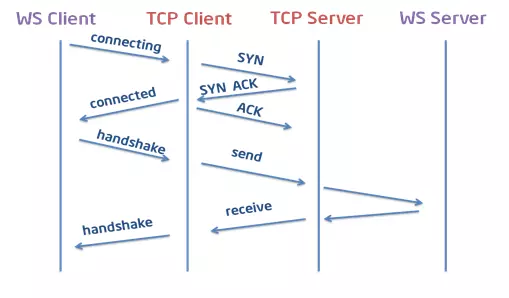

### serviceWorker：
* 1.Service worker运行在worker上下文，因此它不能访问DOM。
* 2.相对于驱动应用的主JavaScript线程，它运行在其他线程中，所以不会造成阻塞。它设计为完全异步，同步API（如XHR和localStorage）不能在service worker中使用。
* 3.出于安全考量，Service workers只能由HTTPS承载，毕竟修改网络请求的能力暴露给中间人攻击会非常危险。在Firefox浏览器的用户隐私模式，Service Worker不可用。
* 4.Service workers大量使用Promise，因为通常它们会等待响应后继续，并根据响应返回一个成功或者失败的操作。Promise非常适合这种场景。
注册-》下载-》安装-》激活
* https://developer.mozilla.org/zh-CN/docs/Web/API/Service_Worker_API
* http://www.alloyteam.com/2016/01/9274/
* http://taobaofed.org/blog/2018/08/08/workbox3/

### PWA
- 基于service worker
- 配置manifest，可配置到主屏到标题，logo，主题等等
- 就是一层代理，拦截所有请求，从而控制整个站点
- 单独的运行环境和执行线程，不操作dom，事件机制通讯，后台运行
- 支持离线缓存，消息推送

### webpack
* https://github.com/gwuhaolin/dive-into-webpack
* https://github.com/ruanyf/webpack-demos#demo01-entry-file-source
* https://juejin.im/post/5acabd696fb9a028c97a5733

### react redux react-router
* 深入REACT技术栈+陈屹著.pdf （必看书目）
* https://github.com/renderedtext/react-redux-demo
* https://coding.imooc.com/learn/list/313.html (综合实例)

### nodejs架构及大概介绍
* https://www.zhihu.com/question/33578075

### minxin, 高阶组件，react hooks
* https://segmentfault.com/a/1190000016950339
* https://zh-hans.reactjs.org/docs/hooks-intro.html

### react生命周期，对比vue，及vue的核心概念

* https://juejin.im/post/5a062fb551882535cd4a4ce3
* https://cn.vuejs.org/v2/guide/instance.html#%E7%94%9F%E5%91%BD%E5%91%A8%E6%9C%9F%E5%9B%BE%E7%A4%BA
* 相比较vue的mvvm框架，react是组件是开发更多关注view，虚拟dom，单向数据流，函数式编程
* 基本指令，模板语法，渲染，事件处理，组件，组件通讯，逻辑复用，路由，状态管理，ajax类库等等。
* 横切逻辑共用： vue mixin 类比 react mixin hoc hooks
* 容器组件：     vue slot（name指定） 类比 react props.children （数组索引）
* 双向通信：     vue props+event 类比 react props+callback
* 渲染：		   vue render(h=>h(component)) 类比 react ReactDOM.render(component, container)
* 全家桶：       vue vuex  Vue-router elmentUI等 类比 react + redux + React router（Browser Router） antdUI等

#### [vue组件通讯，vue组件通信](https://juejin.im/post/5cde0b43f265da03867e78d3)
- prop/事件，父组件A通过props的方式向子组件B传递，B to A 通过在 B 组件中 $emit, A 组件中 v-on 的方式实现。
- 事件总线，这种方法通过一个空的Vue实例作为中央事件总线（事件中心），用它来触发事件和监听事件,巧妙而轻量地实现了任何组件间的通信，包括父子、兄弟、跨级。
- vuex，Vuex实现了一个单向数据流，在全局拥有一个State存放数据，当组件要更改State中的数据时，必须通过Mutation进行，Mutation同时提供了订阅者模式供外部插件调用获取State数据的更新。而当所有异步操作(常见于调用后端接口异步获取更新数据)或批量的同步操作需要走Action，但Action也是无法直接修改State的，还是需要通过Mutation来修改State的数据。最后，根据State的变化，渲染到视图上。


### mvvm原理
* http://www.ruanyifeng.com/blog/2015/02/mvcmvp_mvvm.html
* https://coding.imooc.com/lesson/129.html#mid=9409
* https://github.com/DMQ/mvvm

#### [vue双向绑定原理，defineProperty和proxy优缺点](https://juejin.im/post/5d421bcf6fb9a06af23853f1)
Object.defineProperty+订阅发布模式+解释器compiler解释vue自定义命令
3.0用了proxy
- proxy性能最佳，同时支持全语言特性支持，lazy by default（只有数据被用到才会被监听，所以大规模数据性能很好）
  - 对象属性增加，删除
  - 数组index，length更改
  - map，set，weakmap，weakset
  - classes
  
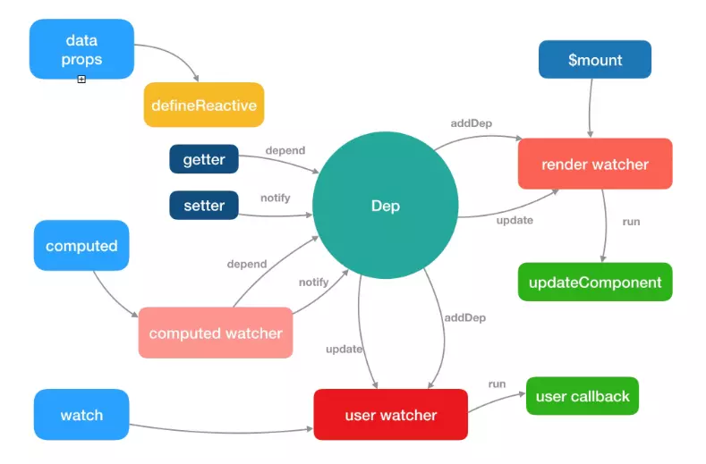


```javascript
  // vue数据双向绑定，使用发布订阅模式，数据劫持，观察者（autorun函数）
    function observe(obj){
      if(Object.prototype.toString.call(obj) !== '[object Object]'){
        throw new TypeError('type error')
      }
      Object.keys(obj).forEach((key)=>{
        let innerValue = obj[key]
        Object.defineProperty(obj, key, {
          get(){            
            dep.depend()
            // console.log('call get ', innerValue)
            return innerValue;
          },
          set(value) {            
            innerValue = value
            dep.notify();
            // console.log('call set ', innerValue)
          }
        })
      })
    }

    let activeUpdate

    class Dep{
      constructor(){
        this.subscribes = new Set()
        // this.subscribes = []
      }
      depend(){
        if(activeUpdate){          
          // this.subscribes.add(activeUpdate)
          // console.log('call depend and add subscribe', this.subscribes.size)
          this.subscribes.push(activeUpdate)
          console.log('call depend and add subscribe', this.subscribes)
        }
      }
      notify(){
        this.subscribes.forEach(sub=>{
          console.log('call notify');
          sub();
        })
      }
    }

    const dep = new Dep()

    function autorun(update){
      function wrapUpdate(){
        activeUpdate = wrapUpdate
        update();
        activeUpdate = null
      }
      wrapUpdate();
    }

    const state = {
      count: 0
    }

    observe(state)

    autorun(() => {
      console.log('first autorun',state.count)
    })
    autorun(() => {
      console.log('second autorun',state.count)
    })
    // should immediately log "count is: 0"

    state.count++
    // should log "count is: 1"
```


#### 数据双向绑定方式及优缺点 mvvm
- 脏检查，Object.defineProperty，proxy，
- 脏检查性能最差但兼容性最好，每次数据变更都需要遍历拥有ng-bind指令都元素
- Object.defineProperty性能次之兼容性次之，ie8+，没有脏检查
- proxy性能最佳，同时支持全语言特性支持，lazy by default（只有数据被用到才会被监听，所以大规模数据性能很好）
  - 对象属性增加，删除
  - 数组index，length更改
  - map，set，weakmap，weakset
  - classes

#### vue生命周期图


#### watch和computed的区别
- 计算属性是基于它们的响应式依赖进行缓存的。只在相关响应式依赖发生改变时它们才会重新求值。
- 虽然计算属性在大多数情况下更合适，但有时也需要一个自定义的侦听器。这就是为什么 Vue 通过 watch 选项提供了一个更通用的方法，来响应数据的变化。当需要在数据变化时执行异步或开销较大的操作时,使用 watch 选项允许我们执行异步操作 (访问一个 API)，限制我们执行该操作的频率，并在我们得到最终结果前，设置中间状态。这些都是计算属性无法做到的。

#### [js延迟加载（动态创建script，或者async，defer） script标签中async和defer有什么区别, async,defer区别](https://segmentfault.com/q/1010000000640869)


### react受控组件和非受控组件
* 受控组件数据由react管理，而非受控组件数据存储在dom中
* 非受控组件往往代码少，且写的比较快，方便和第三方组件结合，虽然不美观，而受控组件状态更新需要写处理函数（change处理函数每一个组件都要写，很烦）
* 但是同一份数据，多个控件，
* 受控组件默认值由defaultValue，defaultChecked
* 文件上传控件始终是非受控组件，因为其值用户设置而非代码设置，
* https://react.docschina.org/docs/uncontrolled-components.html
* http://meloguo.com/2018/10/08/%E5%8F%97%E6%8E%A7%E4%B8%8E%E9%9D%9E%E5%8F%97%E6%8E%A7%E7%BB%84%E4%BB%B6/ （重点看看）

### react事件
* 在 React 底层，主要对合成事件做了两件事:事件委派和自动绑定
* 事件委托在结构的最外层，react自动绑定this，但是es6和纯函数需要手动绑定
* 可以使用原生事件，在componentdidmount中，但是记得在componentwillunmount中移除，防止内存泄漏，合成事件不需要，react已经处理
* 阻止 React 事件冒泡的行为只能用于 React 合成事件系统 中，且没办法阻止原生事件的冒泡。反之，在原生事件中的阻止冒泡行为，却可以阻止 React 合成 事件的传播。
* React 的合成事件系统只是原生 DOM 事件系统的一个子集。它仅仅实现了 DOM Level 3 的事件接口，并且统一了浏览器间的兼容问题。有些事件 React 并没有实现，或者受某些 限制没办法去实现，比如 window 的 resize 事件。
* React 的合成事件则并没有实现事件捕获，仅仅支持了事件冒泡机制。这种 API 设计方式统一而简洁， 符合“二八原则”。

### react router及内部原理，源码分析 
* 在路由跳转过程中，onLeave hook 会在所有将离开的路由中触发，从最下层的子路由开始直到最外层父路由结束。然后onEnter hook会从最外层的父路由开始直到最下层子路由结束。
* https://react-guide.github.io/react-router-cn/index.html
* https://www.jianshu.com/p/6f8babea6243
* http://zhenhua-lee.github.io/react/history.html
* https://github.com/youngwind/blog/issues/109

### react setState过程及源码分析
* https://imweb.io/topic/5b189d04d4c96b9b1b4c4ed6

### react如何借用其他类库的组件，比如jquery
* https://zh-hans.reactjs.org/docs/integrating-with-other-libraries.html

### 牛人博客
* https://segmentfault.com/u/zach5078

### 正则表达式
* https://juejin.im/post/5965943ff265da6c30653879
* https://juejin.im/post/5acb4d3f6fb9a028c813295e
* https://www.cnblogs.com/zxin/archive/2013/01/26/2877765.html
* https://developer.mozilla.org/zh-CN/docs/Web/JavaScript/Guide/Regular_Expressions

#### 浏览器输入网址回车后的一系列事情 输入url回车发生一系列事情
* dns域名解析获取到ip地址（浏览器缓存->系统缓存->路由器缓存->dns服务器缓存->递归搜索）
* 基于ip地址建立tcp连接，tcp三次握手，http连接建立
* 如果是https则还需要进行秘钥交换，随后建立连接
* 服务器接收请求查看http header，看是否有301,302跳转，没有就下载html页面，拿到html静态页面
* 解析页面中的外链，css，js，img等，判断是否有缓存，根据相应策略得到资源
* 同时dom树附加样式产生渲染树
* https://segmentfault.com/a/1190000012092552
* https://blog.csdn.net/LEoe_/article/details/79476279

#### [状态码](https://www.runoob.com/http/http-status-codes.html)
- 1表示信息类，2表示状态类，3表示重定向301永久，302临时 4请求错误403禁止访问，404找不到 5服务器错误 500服务器错误 503服务不可用

#### [http缓存控制](https://blog.csdn.net/u012375924/article/details/82806617)
- 在http中，控制缓存开关的字段有两个：Pragma 和 Cache-Control。
- Pragma有两个字段Pragma和Expires。Pragma的值为no-cache时，表示禁用缓存，Expires的值是一个GMT时间，表示该缓存的有效时间。
Pragma是旧产物，已经逐步抛弃，有些网站为了向下兼容还保留了这两个字段。如果一个报文中同时出现Pragma和Cache-Control时，以Pragma为准。同时出现Cache-Control和Expires时，以Cache-Control为准。即优先级从高到低是 Pragma -> Cache-Control -> Expires

### http https，udp，tcp，三次握手，四次挥别
- tcp面向连接，可靠，正确顺序，三次握手，连接时间长，适合大量数据传输
- udp非面向连接，不可靠，少量数据传输，速度快
- dns中机房到机房用tcp，用户到机房则udp
- TCP三次握手和四次挥手
  - https://cloud.tencent.com/developer/article/1421145
  - https://blog.csdn.net/weixin_39924293/article/details/97371860
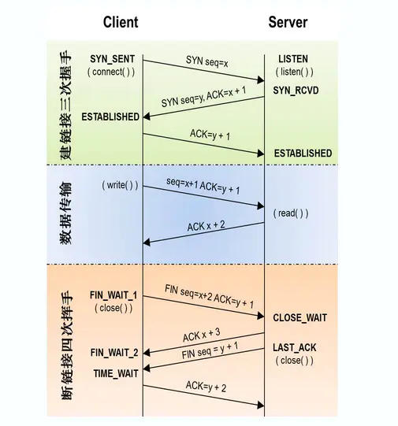
- [tcp保证可靠性](https://blog.csdn.net/cbjcry/article/details/84925028)
  - 校验和,计算方式：在数据传输的过程中，将发送的数据段都当做一个16位的整数。将这些整数加起来。并且前面的进位不能丢弃，补在后面，最后取反，得到校验和。 
    - 发送方：在发送数据之前计算检验和，并进行校验和的填充。
    - 接收方：收到数据后，对数据以同样的方式进行计算，求出校验和，与发送方的进行比对。
    - 注意：如果接收方比对校验和与发送方不一致，那么数据一定传输有误。但是如果接收方比对校验和与发送方一致，数据不一定传输成功。
  - 确认应答与序列号, TCP传输时将每个字节的数据都进行了编号，这就是序列号
    - TCP传输的过程中，每次接收方收到数据后，都会对传输方进行确认应答。也就是发送ACK报文。这个ACK报文当中带有对应的确认序列号，告诉发送方，接收到了哪些数据，下一次的数据从哪里发。
    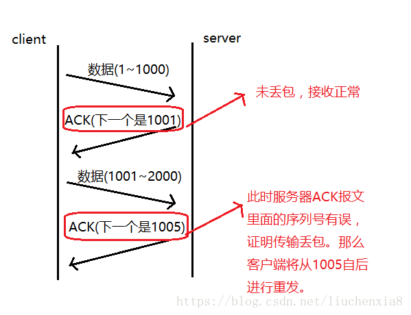
  - 超时重传, 没有收到ack报文原因（接收方没有接收到，发送的ACK报文响应却由于网络原因丢包了）
  - 流量控制，TCP连接的每一方都有固定大小的缓冲空间，TCP的接收端只允许发送端发送接收端缓冲区能接纳的数据
  - 拥塞控制，当网络拥塞时，减少数据的发送，发送方有拥塞窗口，发送数据前比对接收方发过来的即使窗口，取小（以接收方窗口数据为准）， 慢启动、拥塞避免、拥塞发送、快速恢复，TCP的接收端会丢弃重复的数据。 
* https://www.cnblogs.com/zhuqil/archive/2012/07/23/2604572.html
* https://blog.csdn.net/zhongzh86/article/details/69389967
* https://segmentfault.com/a/1190000017524542
- TIMEWAIT问题及解决方案
  - 造成资源被占用，比如端口号，无法处理更多的请求，高并发的天敌
  - net.ipv4.tcp_syncookies = 1 表示开启SYN Cookies。当出现SYN等待队列溢出时，启用cookies来处理，可防范少量SYN攻击，默认为0，表示关闭；
net.ipv4.tcp_tw_reuse = 1 表示开启重用。允许将TIME-WAIT sockets重新用于新的TCP连接，默认为0，表示关闭；
net.ipv4.tcp_tw_recycle = 1 表示开启TCP连接中TIME-WAIT sockets的快速回收，默认为0，表示关闭。
net.ipv4.tcp_fin_timeout 修改系默认的 TIMEOUT 时间
  - vi /etc/sysctl.conf
  - net.ipv4.tcp_keepalive_time = 1200 
  - #表示当keepalive起用的时候，TCP发送keepalive消息的频度。缺省是2小时，改为20分钟。
  - net.ipv4.ip_local_port_range = 1024 65000 
  - #表示用于向外连接的端口范围。缺省情况下很小：32768到61000，改为1024到65000。
  - net.ipv4.tcp_max_syn_backlog = 8192 
  - #表示SYN队列的长度，默认为1024，加大队列长度为8192，可以容纳更多等待连接的网络连接数。
  - net.ipv4.tcp_max_tw_buckets = 5000 
  - #表示系统同时保持TIME_WAIT套接字的最大数量，如果超过这个数字，TIME_WAIT套接字将立刻被清除并打印警告信息。
  - 默认为180000，改为5000。对于Apache、Nginx等服务器，上几行的参数可以很好地减少TIME_WAIT套接字数量，但是对于 Squid，效果却不大。此项  参数可以控制TIME_WAIT套接字的最大数量，避免Squid服务器被大量的TIME_WAIT套接字拖死。

#### http和websocket报文结构


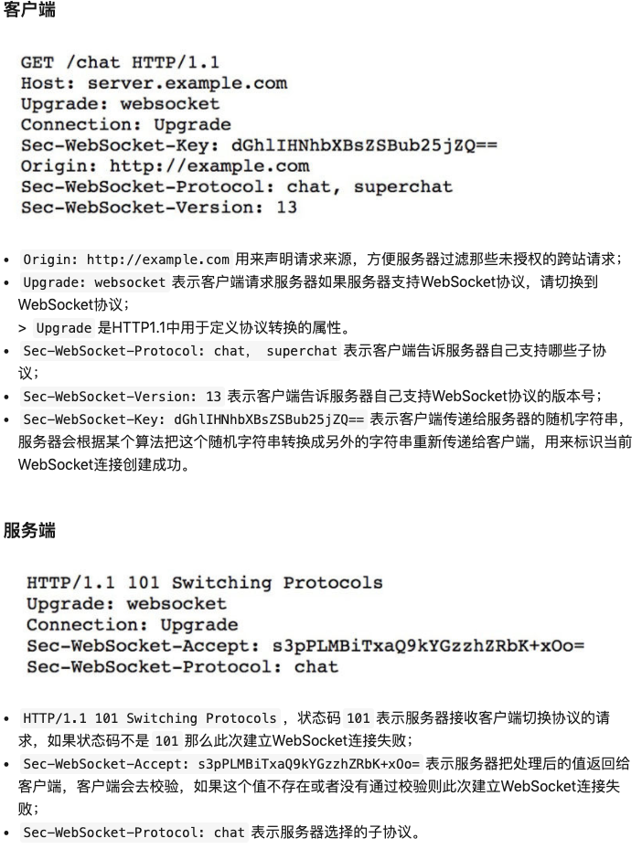

#### https建立的整个过程
- client发送request（包含支持的加密协议及版本）请求到server
- server下发证书（包含公钥），证书为ca颁发的
- client到ca验证证书到合法性，生成随机数及数字签名（即对随机数hash）公钥加密发送到server
- server私钥解密，并用hash验证是否篡改，合法则再生成一个随机信息用client的随机数加密并生成签名（即对随机信息hash）发送到client
- client用随机数解密验证合法性
- 对称加密通讯

#### http劫持及防御
- 因为http是明文传输，所以中间运营商就可以在页面中加人恶意广告代码
- 投诉中间运营商
- 升级成https秘文传输，无法加人任何恶意代码

#### RESTful
- 增加一个朋友，uri: generalcode.cn/v1/friends 接口类型：POST
- 删除一个朋友，uri: generalcode.cn/va/friends 接口类型：DELETE
- 修改一个朋友，uri: generalcode.cn/va/friends 接口类型：PUT
- 查找朋友，uri: generalcode.cn/va/friends 接口类型：GET

#### get，post区别
- GET因为是读取，就可以对GET请求的数据做缓存，没有副作用，幂等
- post往往有副作用，非幂等
- get请求参数都在url中明文，浏览器会缓存，有长度限制2048，而post在请求体中没有长度限制
- post支持Content-Type设置body格式，charset设置字符编码

#### utf8和gbk的区别
- 中文utf8占用3个字节，存储英文文件都是单字节，gbk一个汉字占用两个字节
- GBK包含全部中文字符
- UTF-8则包含全世界所有国家需要用到的字符。
- UTF-8编码的文字可以在各国各种支持UTF8字符集的浏览器上显示
- 所以对于英文多的用utf8省空间，英文单字节，中文多且在国内则用gbk，如果需要国外还是需要utf8，因为国外浏览器没有中文包，会乱码
- GBK、GB2312等与UTF8之间都必须通过Unicode编码才能相互转换，GBK、GB2312－Unicode －UTF8
- ASCII(ISO-8859-1)是鼻祖，最简单的方式，字节高位为0
- GB2312、GBK、GB18030，这几个是中文编码方式，并向下兼容。GB2312包含7000多个汉字和字符，GBK包含21000多个，GB18030更厉害，到了27000多个。他们都是用2个字节来表示一个汉字。跟ascii是怎么区分的呢？如果高字节的高位为1（也就是高字节大于127），就表示是汉字，低字节并无明显特征。
- Unicode是统一编码，它建立了一个全世界统一的码表。世界上的所有文字，在这张码表中都是唯一的
- 

#### 跨域CORS
* http://www.ruanyifeng.com/blog/2016/04/cors.html
- Access-Control-Allow-Origin: http://api.bob.com
Access-Control-Request-Method
Access-Control-Allow-Credentials: true
Access-Control-Expose-Headers: FooBar
- 只要同时满足以下两大条件，就属于简单请求
  - （1) 请求方法是以下三种方法之一：

    HEAD
    GET
    POST
  （2）HTTP的头信息不超出以下几种字段：

    Accept
    Accept-Language
    Content-Language
    Last-Event-ID
    Content-Type：只限于三个值application/x-www-form-urlencoded、multipart/form-data、text/plain

#### [http options HTTP 的 OPTIONS 方法 用于获取目的资源所支持的通信选项。客户端可以对特定的 URL 使用 OPTIONS 方法，也可以对整站（通过将 URL 设置为“*”）使用该方法](https://developer.mozilla.org/zh-CN/docs/Web/HTTP/Methods/OPTIONS)

#### [http1.1存在的问题](https://www.cnblogs.com/ainyi/p/9723563.html)
1、TCP 连接数限制
对于同一个域名，浏览器最多只能同时创建 6~8 个 TCP 连接，调用接口的时候可以看到 (不同浏览器不一样)

2、线头阻塞 (Head Of Line Blocking) 问题
每个 TCP 连接同时只能处理一个请求 - 响应，浏览器按 FIFO 原则处理请求，如果上一个响应没返回，后续请求 - 响应都会受阻。
为了解决此问题，出现了 管线化 - pipelining 技术，但是管线化存在诸多问题，比如第一个响应慢还是会阻塞后续响应、服务器为了按序返回相应需要缓存多个响应占用更多资源、浏览器中途断连重试服务器可能得重新处理多个请求、还有必须客户端 - 代理 - 服务器都支持管线化

3、Header 内容多，而且每次请求 Header 不会变化太多，没有相应的压缩传输优化方案

4、为了尽可能减少请求数，需要做合并文件、雪碧图、资源内联等优化工作，但是这无疑造成了单个请求内容变大延迟变高的问题，且内嵌的资源不能有效地使用缓存机制

5、明文传输不安全

#### http2
- 二进制分帧（所有帧共享8个首字节，包括帧长，类型，标志，保留位标识当前帧，多帧任意发送，通过标识帧组装）
- 首部压缩（客户端有首部表，通过它追加或替换首部）
- 流量控制（每一跳而非端到端，接收方设置流量窗口大小，只有data部分可以控制流量大小）
- [多路复用（基于分帧和首部组装，交错发送请求响应，一个连接并行发送多个请求响应）（多路复用允许同时通过单一的 HTTP/2 连接发起多重的请求-响应消息）](https://www.cnblogs.com/ainyi/p/9723563.html)
  - 与http1.1 keepalive区别（是完全多路复用的，而非有序并阻塞的——只需一个连接即可实现并行）
  - 在一个 TCP 连接上，我们可以向对方不断发送帧，每帧的 stream identifier 的标明这一帧属于哪个流，然后在对方接收时，根据 stream identifier 拼接每个流的所有帧组成一整块数据。
把 HTTP/1.1 每个请求都当作一个流，那么多个请求变成多个流，请求响应数据分成多个帧，不同流中的帧交错地发送给对方，这就是 HTTP/2 中的多路复用。
流的概念实现了单连接上多请求 - 响应并行，解决了线头阻塞的问题，减少了 TCP 连接数量和 TCP 连接慢启动造成的问题
所以 http2 对于同一域名只需要创建一个连接就可以加载页面，而不是像 http/1.1 那样创建 6~8 个连接
- 请求优先级（0最高，2**31-1最低，客户端设置优先级，服务器响应优先级）
- 服务器推送
- 低延迟高吞吐
- 启用http2注意事项，openssl必须是1.0.2e之后版本，只支持https站点（升级到https注意事项参考“http升级https前后端都要注意什么”，即下一个知识点），nginx必须1.9.5以上版本

#### http升级https前后端都要注意什么？
- 前端
  - 资源引用最好的方式是不加协议，用://xxx.xxx.com/
- 后端
  - 安装支持https的nginx版本，包括依赖库
  - 购买ssl证书，放到指定目录
  - 监听443端口，配置证书位置和私钥位置
  - 同时监听80端口，return 301 https://$server_name$request_uri
- https://mp.weixin.qq.com/s/sICGZ55uRgiWAXr-EDGhZw
  
#### http3
- http是基于tcp连接，需要三次握手
- 而http3是基于udp的
- http3炒tcp的作业，发送方对发送的数据进行编号，接收方对接收到的编号进行确认

### 域名收敛
- PC 时代为了突破浏览器的域名并发限制。有了域名发散，但多了dns解析开销及劫持风险
- 收敛则反之，减少多个域名
* https://www.jianshu.com/p/7c7ea420cee8

### nodejs和javascript事件循环(包括macrotask，microtask说明)
* https://nodejs.org/zh-cn/docs/guides/event-loop-timers-and-nexttick/
* http://lynnelv.github.io/js-event-loop-nodejs

#### 事件循环 event loop


### 同步，异步，阻塞，非阻塞概念
- cpu速度比i/o速度快，执行需要等待，就阻塞了，如果同步执行浪费时间
- 所以在nodejs中往往都有异步方法，通过回调达到非阻塞的目的
* https://zhuanlan.zhihu.com/p/22707398
* https://nodejs.org/zh-cn/docs/guides/blocking-vs-non-blocking/

### str.match(reg)返回匹配数组 reg.test(str)返回bool

### new发生了什么
* 创建一个空的简单JavaScript对象（即{}）；
* 链接该对象（即设置该对象的构造函数）到另一个对象 ；
* 将步骤1新创建的对象作为this的上下文 ；
* 如果该函数没有返回对象，则返回this。
* https://developer.mozilla.org/zh-CN/docs/Web/JavaScript/Reference/Operators/new
* https://segmentfault.com/q/1010000005141424

### Promise
* https://developer.mozilla.org/zh-CN/docs/Web/JavaScript/Reference/Global_Objects/Promise
* http://es6.ruanyifeng.com/#docs/promise

### 页面生命周期
* https://github.com/fi3ework/blog/issues/3

### 跨域
* https://segmentfault.com/a/1190000011145364
* https://www.jianshu.com/p/a0dd1e712c3a

### typeof instanceof区别
* https://segmentfault.com/a/1190000000730982
* http://jartto.wang/2019/01/17/js-typeof/

### for in for of forEach 区别
* https://blog.csdn.net/crystal6918/article/details/75099816

### generator
* http://es6.ruanyifeng.com/#docs/generator

### flex
* http://www.ruanyifeng.com/blog/2015/07/flex-grammar.html

### 数据结构与算法
* https://coding.imooc.com/learn/list/315.html
* https://github.com/kdn251/interviews

### 缓存机制,原理
* https://imweb.io/topic/55c6f9bac222e3af6ce235b9
* https://www.jianshu.com/p/1a1536ab01f1
* https://www.jianshu.com/p/54cc04190252
* https://github.com/ljianshu/Blog/blob/master/%E6%96%87%E7%AB%A0%E4%B8%AD%E7%9A%84%E6%80%9D%E7%BB%B4%E5%AF%BC%E5%9B%BE/%E6%B5%8F%E8%A7%88%E5%99%A8%E7%BC%93%E5%AD%98%E6%9C%BA%E5%88%B6.xmind

### meta viewport layout viewport visual viewport ideal viewport
* https://www.cnblogs.com/2050/p/3877280.html
* https://www.quirksmode.org/mobile/viewports2.html
* https://www.runoob.com/w3cnote/viewport-deep-understanding.html

### 前端性能优化
* https://juejin.im/post/59ff2dbe5188254dd935c8ab

#### 前端优化描述，除了雅虎军规之外的优化
- webpack打包优化，动态路由按需加载，长时间缓存，增量更新
- cdn，ssr,服务器端渲染
* pwa，serviceworker
* http2(多路复用，首部压缩，服务器推送，流量控制)，http3基于udp，ttr
* 域名收敛，dns预解析（<meta http-equiv="x-dns-prefetch-control" content="on" ><link rel="dns-prefetch" href="//cdn.domain.com" >）
* 通常情况下，我们认为 TCP 网络传输的最大传输单元（Maximum Transmission Unit，MTU）为 1500B，即一个RTT（Round-Trip Time，网络请求往返时间）内可以传输的数据量最大为 1500 字节。因此，在前后端分离的开发模式中，尽量保证页面的 HTML 内容在 1KB 以内，这样整个 HTML 的内容请求就可以在一个 RTT 内请求完成，最大限度地提高 HTML 载入速度。

### 兼容IE事件工具函数
* https://blog.csdn.net/wangcuiling_123/article/details/73085958

### 关系型数据库和非关系型数据库
- 关系型数据库比非关系型数据库更省硬盘，因为不需要冗余很多数据
- 关系型数据库比非关系型数据库，更容易追踪数据之间的关系，如果需要追踪复杂的关系需要使用关系型数据库
- 如果需要数据实时性强（要求数据库强一致性），那么读写可能都会慢一点，则使用关系型数据库
- 如果要求数据读写快，实时性可以有延迟，则可以使用非关系型数据库

### h5原生优缺点
* https://www.jianshu.com/p/daeacf35e72f

### amd和cmd区别，import区别，及import异步实现
* amd有requirejs，cmd有seajs，这些规范的目的都是为了 JavaScript 的模块化开发，特别是在浏览器端的
* 对于依赖的模块，AMD 是提前执行，CMD 是延迟执行。不过 RequireJS 从 2.0 开始，也改成可以延迟执行（根据写法不同，处理方式不同）。CMD 推崇 as lazy as possible.
* CMD 推崇依赖就近，AMD 推崇依赖前置。
* https://www.zhihu.com/question/20351507

### requirejs常用方法
* http://www.hangge.com/blog/cache/detail_1702.html

### buffer模块
* buffer用来处理大量二进制数据，操作字节；类Array对象，javascript和C++模块结合体，性能c，非性能js
* 内存不是v8分配，属于堆外内存，buffer太常见，默认无需require即可使用
* 拼接不能+号，而是通过ondata方式，onend再转换成字符串
* 网络传输二进制最高效

### Stream是什么
* node有内存限制，大文件操作用stream，node原生模块直接引用即可
* 当不能通过fs.readFile,fs,writeFile时，使用fs.createReadStream,fs,createWriteStream

### http模块实现异步变同步请求
* https://blog.csdn.net/WANGLEI20116527/article/details/62892070

### utf8和gbk区别
* UTF-8：Unicode TransformationFormat-8bit，允许含BOM，但通常不含BOM。是用以解决国际上字符的一种多字节编码，它对英文使用8位（即一个字节），中文使用24为（三个字节）来编码。UTF-8包含全世界所有国家需要用到的字符，是国际编码，通用性强。UTF-8编码的文字可以在各国支持UTF8字符集的浏览器上显示。如，如果是UTF8编码，则在外国人的英文IE上也能显示中文，他们无需下载IE的中文语言支持包。
GBK是国家标准GB2312基础上扩容后兼容GB2312的标准。GBK的文字编码是用双字节来表示的，即不论中、英文字符均使用双字节来表示，为了区分中文，将其最高位都设定成1。GBK包含全部中文字符，是国家编码，通用性比UTF8差，不过UTF8占用的数据库比GBD大。

### 前端数据采集
- onError事件，try catch，自定义错误及日志
- html5的performance帮助采集性能数据
* https://cdc.tencent.com/2018/09/13/frontend-exception-monitor-research/

### 腾讯面试题
#### jsonp有哪些安全问题，服务端可能存在csrf攻击
* 从消费者的角度来看：
* 必须相信提供商不会返回恶意JavaScript，而不是返回指定的JSONP回调中包含的预期JSON。
* 任何第三方JavaScript嵌入式附件（例如Google Analytics）也是如此。
* 这与XSS攻击类似，它允许第三方在应用程序中执行任意JavaScript，但是，必须首先通过首先提出请求来选择信任该第三方。
* 从提供者的角度来看：
* 即使客户的Cookie存在于您的控制网页的请求中，也不能认为该消息是存在的。检查Referer标头与授权URL的白名单，并且/或不要依赖基于cookie的认证。
* 类似于CSRF /混淆的副攻击。
* https://erlend.oftedal.no/blog/static-130.html?blogid=130
* https://cloud.tencent.com/developer/ask/77723
* https://www.jianshu.com/p/14f569b13dcc
* https://erlend.oftedal.no/blog/static-130.html?blogid=130
* 未来浏览器允许设置合法域携带cookie，这样就无法实现csrf攻击了  
* https://www.acunetix.com/blog/articles/chrome-tightens-csrf-protection/ 
* https://www.jianshu.com/p/66f77b8f1759

#### jsonp缺点
- 它只支持GET请求而不支持POST等其它类型的HTTP请求
- 它只支持跨域HTTP请求这种情况，不能解决不同域的两个页面之间如何进行JavaScript调用的问题（此处需要使用html5的postmessage），非通用方案
- jsonp在调用失败的时候不会返回各种HTTP状态码
- 缺点是安全性。万一假如提供jsonp的服务存在页面注入漏洞，即它返回的javascript的内容被人控制的。那么结果是什么？所有调用这个 jsonp的网站都会存在漏洞。于是无法把危险控制在一个域名下…所以在使用jsonp的时候必须要保证使用的jsonp服务必须是安全可信的

#### 跨域携带cookie，第一种使用代理，第二种cors，服务器设置Access-Control-Allow-Credentials字段为true，Access-Control-Allow-Origin为白名单域名；同时客户端设置withCredentials: true，crossDomain:true, 设置跨域为true
- a.com跨域请求到b.com, withCredentials: true则会带上a.com的cookie
- 但a,b域依然受同源策略限制，a,b不能相互访问设置对方的cookie，即永远不会影响到同源请求
- 不同域下的XmlHttpRequest 响应，不论其Access-Control- header 设置什么值，都无法为它自身站点设置cookie值，除非它在请求之前将withCredentials 设为true。

#### 怎么防止重复提交
* 多次submit按钮，刷新，回退会造成重复提交，前端和后端分别如何防御
* https://hw1287789687.iteye.com/blog/2427055
* https://www.jianshu.com/p/01b6ab61f24a

#### 怎么防止提交当价格被篡改，及防止重放攻击
* 对参数做数字签名，生产signature，提交服务器回传，服务器密钥参数再hash与signatrue对比即可知道是否被串改
- 防止重放攻击必须要保证请求仅一次有效，需要通过在请求体中携带当前请求的唯一标识，并且进行签名防止被篡改。所以防止重放攻击需要建立在防止签名被串改的基础之上。
- 通过nonce判断请求是否已经处理过，通过timestamp+过期时间可以保证服务器缓存定时清理
* https://blog.csdn.net/u014756827/article/details/86631118

#### react两个组件中的请求有依赖如何处理
* 使用高阶组件，假如a依赖b，两种方式，一是通过props.callback，b中componentWillReceiveProps拿到a中异步请求依赖数据，二是通过hoc，b作为传人组件，高阶组件中实现a对逻辑，请求返回数据后，通过props传入b组件，形成增强组件

#### react中虚拟dom diff算法
陈屹《深入react技术栈》

#### 跨域cors的http头要设置哪些，以及浏览器如何发送预检请求，整个原理说一说
* Access-Control-Allow-Origin: http://foo.example
* Access-Control-Allow-Methods: POST, GET, OPTIONS
* Access-Control-Allow-Headers: X-PINGOTHER, Content-Type
* Access-Control-Max-Age: 86400
* https://developer.mozilla.org/zh-CN/docs/Web/HTTP/Access_control_CORS
* http://www.ruanyifeng.com/blog/2016/04/cors.html

#### 前端埋点监控怎么做（白屏，首屏，onload时间，html5的performance）
* head开发的地方定义起始时间，body开始处定义白屏结束时间，首屏html片段处定义首屏结束时间
* 使用html5 performance.timing的api，有各个阶段详细的时间点

#### react生命周期，及再didmount和willunmout一般做什么
componentDidMount： dom已经加装到页面，可以操作页面dom，比如集成第三方框架
componentWillUnmount：清理垃圾，比如删除绑定的事件等等内存回收的地方

#### 前端clone，深拷贝
* JSON.parse(JSON.stringify(XXXX)) （不能复制function、正则、Symbol，循环引用）
* 手写递归自己实现，简单类型，直接复制。对于引用类型，递归复制它的每一个属性，注意循环引用，使用缓存对象做判断（参考alibaba/alibaba.html）
* 使用lodash的deepclone
* 使用html5的方式拷贝，但是最大的问题是异步

#### 前端继承的方式有哪些
- 借用父级构造函数，二是通过原型，三是通过两种的组合方式（other/oop.html）
- __proto__指向构造函数的prototype对象，而非构造函数
- 

#### 缓存机制及如何定制缓存时间？为什么使用这种策略？
* https://imweb.io/topic/5795dcb6fb312541492eda8c

#### setTimeout和setImmediate区别
* node中执行顺序不确定，因为setTimeout不能做到0毫秒执行，分别在timer阶段和check阶段，process.tick优先级最高，每个阶段执行完就执行tick
* http://www.ruanyifeng.com/blog/2018/02/node-event-loop.html
* setTimeout无法保证指定时间后执行，那该如何保证指定时间后一定执行


#### react数据流说说看
* 推崇简单的自顶向下的单向数据流，双向绑定可以用回调

#### 如何提高用户的转化率（更快下单）
* 首先页面加载速度要快，让用户快速看到支付按钮
* 交互响应要及时，提示友好
* 页面设计要简洁清爽，支付按钮要突出，用户容易找到（不要一堆广告），支付页面的核心是让用户快速完成支付
* 不能有中断性的广告啊，提示呀
* 异常处理要友好，比如支付失败，有重新支付按钮，不能让用户有多余的操作
* 所有的广告可以移到支付成功页去

#### javascript将扁平的数据转为树形结构
* https://blog.csdn.net/qq_37746973/article/details/78662177

#### nodejs如何利用多核cpu
- cluster模块(child_process,net组合)
- 使用child_process模块，提供了child_process.fork()函数实现进程复制，onmessage,send来监听和发送消息

#### [响应式布局](https://juejin.im/post/6844903814332432397)
- <meta name="viewport" content="width=device-width, initial-scale=1" />
- 媒体查询（media queries)
- 百分比布局
- rem布局
- 视口单位
- rem,vw,淘宝的felxiable库
- 图片响应式
  - 使用max-width（图片自适应）
  - 使用srcset
  - 使用picture标签
- srcset解决图片高清问题
- 尽量用svg或者css3构建一些背景图，替代png
- 1px问题
  - viewport+rem+js（对整个网页进行缩放）
  - 直接1/dpr设置像素
  - 伪元素+transform:scale(1,0.5)
  - 图片，每次更新颜色要换背景图片
  - boxshodow
- 响应式布局的成型方案
  - 利用上面的方法自己来实现，比如CSS3 Media Query,rem，vw等
  - Flex弹性布局，兼容性较差
  - Grid网格布局，兼容性较差
  - Columns栅格系统，往往需要依赖某个UI库，如Bootstrap
- 响应式布局的要点
  - 设置viewport
  - 媒体查询
  - 字体的适配（字体单位）
  - 百分比布局
  - 图片的适配（图片的响应式）
  - 结合flex，grid，BFC，栅格系统等已经成型的方案

#### for in和Reflect.ownKeys
- for in 遍历所有可枚举属性
- Reflect.ownKeys遍历所有属性（包括不可枚举）

#### for in和for of
- for in遍历的时候是key值
- for of遍历的是[key, value]可遍历所有实现了iterbale的列表

#### [new发生了什么](https://developer.mozilla.org/zh-CN/docs/Web/JavaScript/Reference/Operators/new)
- 创建一个空的简单JavaScript对象（即{}）；
- 链接该对象（即设置该对象的构造函数）到另一个对象 ；
- 将步骤1新创建的对象作为this的上下文 ；
- 如果该函数没有返回对象，则返回this，如果返回非对象则忽略（即还是返回this）

#### React与三方库协同
- 集成带有 DOM 操作的插件
  - 做组件隔离，你可以渲染一个无需更新到react元素，然后组件放在这个div里面隔离
  - 留一个ref值给jquery插件即可
  - 要注意自己去销毁注册的事件防止内存泄漏

#### ES6
- const,let,默认参数，箭头函数，尾调用优化，解构对象、数组，for of 展开运算符，set，map，Array.from
- const 定义一个常量，且必须初始化，不可修改，但如果定义的是对象，对象的属性可以修改，因为对象属性的修改不影响对象（或者说并没有修改对象）
- [es6 set](https://developer.mozilla.org/zh-CN/docs/Web/JavaScript/Reference/Global_Objects/Set)
  - Set 对象允许你存储任何类型的唯一值，无论是原始值或者是对象引用。
  - new Set([1, 2, 3, 4, 5]);
- [es6 map](https://developer.mozilla.org/zh-CN/docs/Web/JavaScript/Reference/Global_Objects/Map)
  - Map 对象保存键值对，并且能够记住键的原始插入顺序。任何值(对象或者原始值) 都可以作为一个键或一个值。
  - 一个Map对象在迭代时会根据对象中元素的插入顺序来进行, for...of,循环在每次迭代后会返回一个形式为[key，value]的数组
  - new Map([ [3, 'three'], [2, 'two'], [1, 'eins'] ])

#### 箭头函数和普通函数区别
- 箭头函数不能new，没有prototype
- this指向定义时父函数（如果父也是箭头函数则往上再找）所指的this
- 没有arguments绑定，使用rest替代
- call和apply不会改变this指向

#### css布局方式
- position
- display: table,子元素 table-cell
- flex,一维布局
- grid，二维布局

#### [float和display：inline-block；的区别](https://developer.mozilla.org/zh-CN/docs/CSS/float)
- 由于float意味着使用块布局，它在某些情况下修改display 值的计算值：
- float会脱离正常文档流，但仍然保持部分流动性，所以可以文字环绕它
- 使用float需要清理float否则影响父元素尺寸
- display：inline-block只是单纯的把元素设置为行内块

#### es6中的class
- 类中的prototype不可以被重写
- 所有成员不可枚举
- 必须使用new调用构造函数
- 只可以在派生类中使用super函数且只能第一个使用，new.target指向构造函数
  
#### 浏览器存储数据有cookie，localstorage，sessionstorage，indexDB
- cookie大概4kb左右，http请求会携带给服务器
- 本地存储5m

#### cookie格式以分号隔开，name=value;Expires=time; Max-Age=22;Domain=aa.com;path=/;Secure;HttpOnly;SameSite

#### 5.15多少度 67.5度

#### 数字和字母8位  /^[0-9a-zA-Z]{8,}$/意思是数字或字母长度至少为8位，/^(?![0-9]+$)(?![a-zA-Z]+$)[0-9A-Za-z]*$/ 数字和字母组合
- https://developer.mozilla.org/zh-CN/docs/Web/JavaScript/Guide/Regular_Expressions
- 对 "123abc" 使用 /\d+/ 将会匹配 "123"，而使用 /\d+?/ 则只会匹配到 "1"。
- /(?:foo){1,2}/。如果表达式是 /foo{1,2}/，{1,2} 将只应用于 'foo' 的最后一个字符 'o'。如果使用非捕获括号，则 {1,2} 会应用于整个 'foo' 单词。
- /Jack(?=Sprat)/会匹配到'Jack'仅当它后面跟着'Sprat'。/Jack(?=Sprat|Frost)/匹配‘Jack’仅当它后面跟着'Sprat'或者是‘Frost’。但是‘Sprat’和‘Frost’都不是匹配结果的一部分。
- /(?<=Jack)Sprat/会匹配到' Sprat '仅仅当它前面是' Jack '。/(?<=Jack|Tom)Sprat/匹配‘ Sprat ’仅仅当它前面是'Jack'或者是‘Tom’。但是‘Jack’和‘Tom’都不是匹配结果的一部分。
- 

#### 负载均衡
- 轮循算法，就是将来自网络的请求依次分配给集群中的节点进行处理。
- 最小连接数算法，就是为集群中的每台服务器设置一个记数器，记录每个服务器当前的连接数，负载均衡系统总是选择当前连接数最少的服务器分配任务。
- 快速响应优先算法，是根据群集中的节点的状态（CPU、内存等主要处理部分）来分配任务。 这一点很难做到，事实上到目前为止，采用这个算法的负载均衡系统还很少。尤其对于硬件负载均衡设备来说，只能在TCP/IP协议方面做工作，几乎不可能深入到服务器的处理系统中进行监测。但是它是未来发展的方向。

#### href是当前元素与链接资源的关联，非阻塞；而src引入的资源是页面不可少部分，嵌入页面当前位置，要占位置

#### title是站点级别标题，h是文章标题，而em和strong是部分强调

#### 事件注册到同一元素与冒泡捕获无关，触发的顺序只与注册先后有关

#### let，var
- var声明要么全局要么函数作用域
- let局部作用域，不会声明提升，不能重复声明

### [进程与线程](https://www.jianshu.com/p/a4fa4edbeb8a)
- [进程状态](https://blog.csdn.net/qicheng777/article/details/77427157)
  - 进程挂起：由于进程的不断创建，系统资源特别是主存资源已不能满足所有进程运行的要求。这时，就必须将某些进程挂起，放到磁盘对换区，暂时不参加调度，以平衡系统负载；进程挂起的原因可能是系统故障，或者是用户调试程序，也可能是需要检查问题。
  - 进程阻塞：比如等待I/O

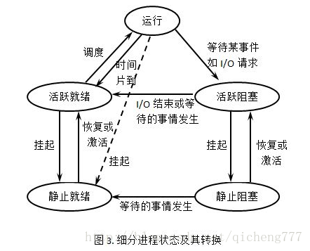
- 线程是进程中执行运算的最小单位，是进程中的一个实体，是被系统独立调度和分派的基本单位，线程自己不拥有系统资源，只拥有一点在运行中必不可少的资源，但它可与同属一个进程的其它线程共享进程所拥有的全部资源。一个线程可以创建和撤消另一个线程，同一进程中的多个线程之间可以并发执行优点：
  - 易于调度。
  - 提高并发性。通过线程可方便有效地实现并发性。进程可创建多个线程来执行同一程序的不同部分。
  - 开销少。创建线程比创建进程要快，所需开销很少。。
  - 利于充分发挥多处理器的功能。通过创建多线程进程，每个线程在一个处理器上运行，从而实现应用程序的并发性，使每个处理器都得到充分运行。
- 进程可以包含多个线程，线不可包含多个进程
- 资源分配给进程，同一进程的所有线程共享该进程的所有资源。
- 进程独占内存，线程共享内存
- 进程上下文切换大于线程切换消耗
- 进程和线程的区别
  - 调度：线程作为调度和分配的基本单位，进程作为拥有资源的基本单位
  - 并发性：不仅进程之间可以并发执行，同一个进程的多个线程之间也可并发执行
  - 拥有资源：进程是拥有资源的一个独立单位，线程不拥有系统资源，但可以访问隶属于进程的资源.
  - 系统开销：在创建或撤消进程时，由于系统都要为之分配和回收资源，导致系统的开销明显大于创建或撤消线程时的开销。
- 进程间通信的方式
  - 管道（pipe）及有名管道（named pipe）：管道可用于具有亲缘关系的父子进程间的通信，有名管道除了具有管道所具有的功能外，它还允许无亲缘关系进程间的通信。
  - 信号（signal）：信号是在软件层次上对中断机制的一种模拟，它是比较复杂的通信方式，用于通知进程有某事件发生，一个进程收到一个信号与处理器收到一个中断请求效果上可以说是一致的。
  - 消息队列（message queue）：消息队列是消息的链接表，它克服了上两种通信方式中信号量有限的缺点，具有写权限得进程可以按照一定得规则向消息队列中添加新信息；对消息队列有读权限得进程则可以从消息队列中读取信息。
  - 共享内存（shared memory）：可以说这是最有用的进程间通信方式。它使得多个进程可以访问同一块内存空间，不同进程可以及时看到对方进程中对共享内存中数据得更新。这种方式需要依靠某种同步操作，如互斥锁和信号量等。
  - 信号量（semaphore）：主要作为进程之间及同一种进程的不同线程之间得同步和互斥手段。
  - 套接字（socket）：这是一种更为一般得进程间通信机制，它可用于网络中不同机器之间的进程间通信，应用非常广泛。
- 线程通信方式
  - 多个线程可能更改全局变量，因此全局变量最好声明为volatile
  - 使用消息实现通信
  - 使用事件CEvent类实现线程间通信，Event对象有两种状态：有信号和无信号，线程可以监视处于有信号状态的事件，以便在适当的时候执行对事件的操作

#### select, poll, epoll区别

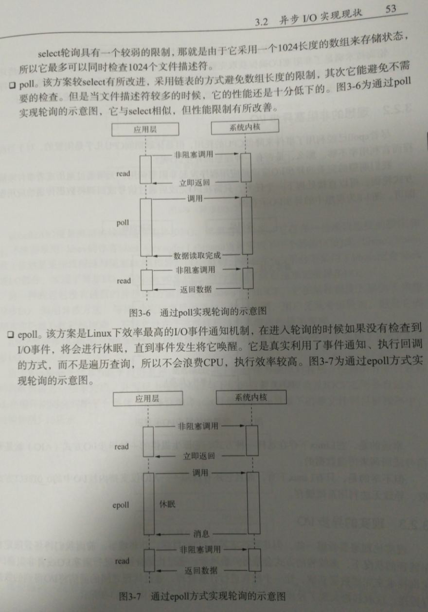

#### [死锁,死锁原因，死锁解决方案]()
- 互斥，请求保持，不可剥夺，循环等待
  - 1. 互斥条件：一个资源每次只能被一个线程使用。
  - 1. 请求与保持条件：一个进程因请求资源而阻塞时，对已获得的资源保持不放。
  - 2. 不剥夺条件：进程已获得的资源，在未使用完之前，不能强行剥夺。
  - 3. 循环等待条件：若干进程之间形成一种头尾相接的循环等待资源关系。
- 一次分配好所有资源
- 减少资源占用时间，减少竞争资源，顺序访问资源
- 系统在进行资源分配之前预先计算资源分配的安全性。若此次分配不会导致系统进入不安全状态，则将资源分配给进程；否则，进程等待。其中最具有代表性的避免死锁算法是银行家算法。即银行可贷款额度为10，已经贷出去8，那最多可请求2个资源，超出就等待，保证处于安全状态

#### n个台阶，每次只能走一步或两步，有多少种走法，斐波那契数列

#### [sql join](https://www.cnblogs.com/logon/p/3748020.html)
- inner join保留两张表中完全匹配到结果集（交集）
- left join以左表为准的结果集合，即使右表没有（）
- right join以右表为准的结果集合，即使左表没有
- full join左右表的并集（并集）

#### 防止参数被篡改，使用数字签名，即对参数做hash签名，服务器端校验参数和签名是否一致即可辨别是否被篡改

### 浏览器缓存
- 首先通过expires（1.0），cache-control判断缓存是否过期，如果没有过期使用浏览器缓存不发请求
- 过期则发请求，会带上etag或者last-modify与服务器上的相应值对比，如果没有变化返回304，否则返回新文件和新的etag和modify时间戳
- 如果需要强制更新，加版本号或者文件hash
- modify只能精确到秒

#### 使用fastclick解决移动端单击延迟问题，点透问题（因为单击延迟，所以浮层隐藏后会单击到下面到元素）

#### disable readonly区别都不可更改，但readonly会提交数据，input针对输入框，而disable针对所有表单

#### 数据结构复杂度，排序算法复杂度
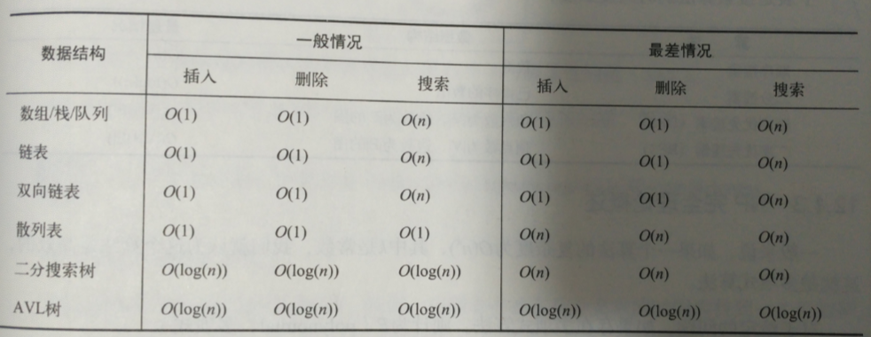
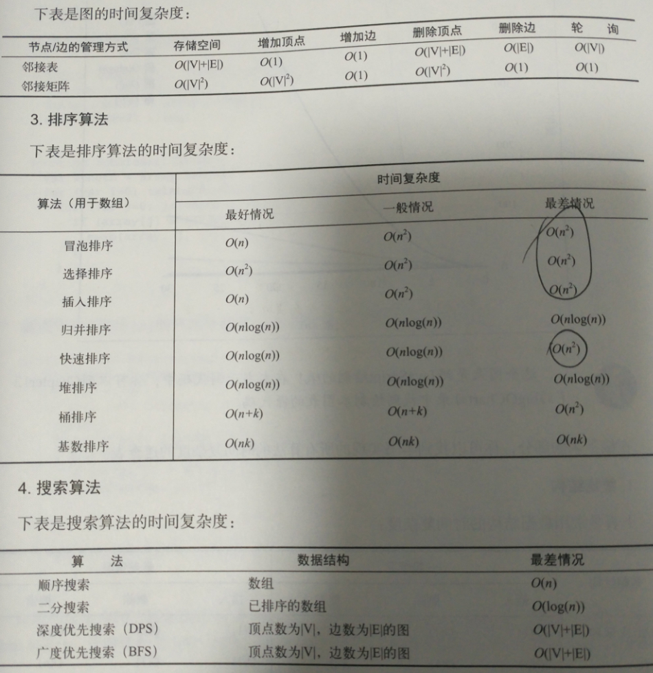
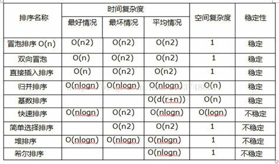

#### [leetCode试题](https://www.cnblogs.com/grandyang/p/4606334.html)

#### [javascript正则去除注释（删除注释）](https://blog.csdn.net/justoneroad/article/details/8227254)
```javascript
var reg = /("([^\\\"]*(\\.)?)*")|('([^\\\']*(\\.)?)*')|(\/{2,}.*?(\r|\n))|(\/\*(\n|.)*?\*\/)/g,// 正则表达式
    str = $('event').html(); // 欲处理的文本
console.log(str); // 打印出：原文本
console.log(str.match(reg));// 打印出：匹配子串
str.replace(reg, function(word) { // 去除注释后的文本
    return /^\/{2,}/.test(word) || /^\/\*/.test(word) ? "" : word;
});
```

#### 把1000个苹果分到10个箱子里。分好后随便我要几个苹果，你都可以整箱整箱的搬给我
- 1，2，4，8，16，32，64，128，256，512 
$$ 2^{n-1} $$

#### [如果一个处理器同时只能处理一个进程，现给出每个进程的时间戳，问最少需要几个处理器才能全部处理完毕?（leetcode 253）](https://www.cnblogs.com/grandyang/p/5244720.html)

#### [滑动窗口最大值问题](https://www.cnblogs.com/grandyang/p/4656517.html)

#### [断点续传](https://juejin.im/post/5dff8a26e51d4558105420ed)

#### 异常捕获，异常监控
- window.error事件
- 使用try catch，reject会触发
- Promise全局异常使用window.addEventListener('unhandledrejection', function browserRejectionHandler(event) {
  event && event.preventDefault()
})
- componentDidCatch(error：抛出的错误, info：带有 componentStack key 的对象，其中包含有关组件引发错误的栈信息) 

#### [js懒加载原理](https://blog.csdn.net/qq_25600055/article/details/82086377)

#### [懒加载延迟加载新api，IntersectionObserver API 使用教程](http://www.ruanyifeng.com/blog/2016/11/intersectionobserver_api.html)

#### css3 animation css3动画
- @keyframes myfirst
{
    from {background: red;}
    to {background: yellow;}
}
@keyframes myfirst
{
    0%   {background: red; left:0px; top:0px;}
    25%  {background: yellow; left:200px; top:0px;}
    50%  {background: blue; left:200px; top:200px;}
    75%  {background: green; left:0px; top:200px;}
    100% {background: red; left:0px; top:0px;}
}
- animation: 
{
  animation-name: myfirst;
  animation-duration: 5s;
  animation-timing-function: linear;
  animation-delay: 2s;
  animation-iteration-count: infinite;
  animation-direction: alternate;
  animation-play-state: running;
}

#### nodejs主进程和子进程挂了怎么办
- 如果子进程挂了，通过监听子进程的exit，uncaughtException事件自动重启，其实就是再递归调用自己一次
  - 同时监听process主进程的exit事件，这样可以温和的kill所有子进程
- 通过监听主进程即process的exit，uncaughtException事件来

#### react性能优化
- 列表有key值
- 不要在组件内联箭头函数，而应该先声明传引用
- 打包使用生产环境的包，mode: 'production'
- BundleAnalyzerPlugin插件分析脚本大小
- 虚拟长列表react-window 和 react-virtualized 是热门的虚拟滚动库
- shouldComponentUpdate(nextProps, nextState) 默认返回true表示需要diff更新dom，false不diff更新dom
- 使用PureComponent组件，无状态组件
  - React.PureComponent 与 React.Component 很相似。两者的区别在于 React.Component 并未实现 shouldComponentUpdate()，而 React.PureComponent 中以浅层对比 prop 和 state 的方式来实现了该函数。
  - 仅在你的 props 和 state 较为简单时，才使用 React.PureComponent，或者在深层数据结构发生变化时调用 forceUpdate() 来确保组件被正确地更新。你也可以考虑使用 immutable 对象加速嵌套数据的比较。
  - 此外，React.PureComponent 中的 shouldComponentUpdate() 将跳过所有子组件树的 prop 更新。因此，请确保所有子组件也都是“纯”的组件。
- react喜欢稳定对dom结构，所以要减少删除增加渲染，要优化条件渲染，同时使用隐藏显示方式
- Fragments避免额外标记，层级减少
- css动画替代javascript动画
- 使用cdn网络，gzip压缩，web worker处理cpu密集型任务，服务器端渲染
- 在 Constructor 的早期绑定函数
- 节流（throttling）和防抖（debouncing）可用来限制在指定时间内调用的事件处理程序的数量
- 动态加载路由，按需加载，react-loadable组件，或者使用react.lazy,suspense
- 对于函数式组件可以使用useCallback（防止子组件无意义重渲染）
- 使用useMemo,memo缓存组件结果，防止重复渲染
  - React.memo 为高阶组件。它与 React.PureComponent 非常相似，但它适用于函数组件，但不适用于 class 组件。
  - 如果你的函数组件在给定相同 props 的情况下渲染相同的结果，那么你可以通过将其包装在 React.memo 中调用，以此通过记忆组件渲染结果的方式来提高组件的性能表现。这意味着在这种情况下，React 将跳过渲染组件的操作并直接复用最近一次渲染的结果
  - React.memo(MyComponent, areEqual)
    - 默认情况下其只会对复杂对象做浅层对比，如果你想要控制对比过程，那么请将自定义的比较函数通过第二个参数传入来实现。
- 使用不可变数据Immutable
- reselect，在使用Redux过程中，组件的状态数据通常是从state派生出来的，要做很多计算的逻辑，对计算缓存
- [react新特性，concurrent模式使用时间分片的方式处理，所以每个分片的任务有不同的阶段，React Fiber把更新过程碎片化](https://zhuanlan.zhihu.com/p/26027085)
  - 优先级高的更新任务会优先处理完，而低优先级更新任务所做的工作则会完全作废，然后等待机会重头再来
  - 因为一个更新过程可能被打断，所以React Fiber一个更新过程被分为两个阶段(Phase)：第一个阶段Reconciliation Phase和第二阶段Commit Phase。
  - 在第一阶段Reconciliation Phase，React Fiber会找出需要更新哪些DOM，这个阶段是可以被打断的；但是到了第二阶段Commit Phase，那就一鼓作气把DOM更新完，绝不会被打断。
  - 以render函数为界，第一阶段可能会调用下面这些生命周期函数，说是“可能会调用”是因为不同生命周期调用的函数不同。
    componentWillMount
    componentWillReceiveProps
    shouldComponentUpdate
    componentWillUpdate
    下面这些生命周期函数则会在第二阶段调用。
    componentDidMount
    componentDidUpdate
    componentWillUnmount
  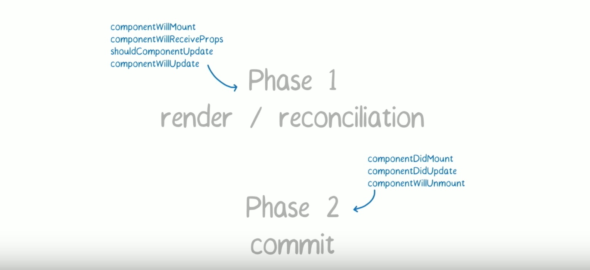

#### react hook优化
- 使用useMemo,useCallback(防止子组件重复渲染)
  - 推荐使用 React.useMemo 而不是 React.memo，因为在组件通信时存在 React.useContext 的用法，这种用法会使所有用到的组件重渲染，只有 React.useMemo 能处理这种场景的按需渲染。
- 依赖一定要写清楚，提前声明
- useRef 尽量少用，大量 Mutable 的数据会影响代码的可维护性，但对于不需重复初始化的对象推荐使用 useRef 存储，比如 new G2()
- 局部状态不推荐使用 useReducer ，会导致函数内部状态过于复杂，难以阅读。 useReducer 建议在多组件间通信时，结合 useContext 一起使用。
- 组件间通讯使用useContext+reducer，复杂的还是使用redux
- 当输入框频繁输入时，为了保证页面流畅，我们会选择在 onChange 时进行 debounce

#### [tree shoking原理](https://twindy.org/qian-xi-tree-shakinggong-zuo-yuan-li/)
- tree shaking 不支持动态导入（如CommonJS的require()语法），只支持纯静态的导入（ES6的import/export）
- webpack中可以在项目package.json文件中，添加一个 “sideEffects” 属性,手动指定由副作用的脚本


#### null和undefined区别
- null表示"没有对象"，即该处不应该有值
- undefined表示"缺少值"，就是此处应该有一个值，但是还没有定义
  - （1）变量被声明了，但没有赋值时，就等于undefined。
（2) 调用函数时，应该提供的参数没有提供，该参数等于undefined。
（3）对象没有赋值的属性，该属性的值为undefined。
（4）函数没有返回值时，默认返回undefined。

#### 浏览器内核

<table>
<thead>
<tr>
  <th>浏览器</th>
  <th>渲染引擎</th>
  <th>-</th>
  <th>JS引擎</th>
</tr>
</thead>
<tbody><tr>
  <td>IE</td>
  <td>Trident</td>
  <td>–</td>
  <td>Chakra</td>
</tr>
<tr>
  <td>Firefox</td>
  <td>Gecko</td>
  <td>–</td>
  <td>SpiderMonkey</td>
</tr>
<tr>
  <td>Chrome</td>
  <td>Webkit</td>
  <td>Webcore</td>
  <td>V8</td>
</tr>
<tr>
  <td>Safri</td>
  <td>Webkit</td>
  <td>Webcore</td>
  <td>javascriptcore</td>
</tr>
<tr>
  <td>Opera</td>
  <td>Presto</td>
  <td>–</td>
  <td>Carakan</td>
</tr>
</tbody></table>

#### nodejs全局异常处理
- 中间件错误监控
/* 全局错误抛出 */
app.use((error, req, res, next) =&gt; {
  if (error) {
    res.json({ msg: error.message, code: error.code })
  }
});
- 全局错误监控，任何全局未处理的异常都可以通过监听进程上的“uncaughtException”事件来拦截，如果任何事件发射器引发`error`事件，并且没有为此事件预订事件发射器的监听器，则在进程上也会引发`uncaughtError`事件。
- exit事件在进程即将退出时发出

#### [heap vs stack 堆和栈的优缺点,栈适合递归，历史记录撤销操作，堆完全搜索二叉树，求第k大小的值](https://www.guru99.com/stack-vs-heap.html)
<table class="table1 table-striped"><thead><tr><th><strong>Parameter</strong> </th><th><strong>Stack</strong> </th><th><strong>Heap</strong> </th></tr></thead><tbody><tr><td>Type of data structures </td><td>A stack is a linear data structure. </td><td>Heap is a hierarchical data structure. </td></tr><tr><td>Access speed </td><td>High-speed access </td><td>Slower compared to stack </td></tr><tr><td>Space management </td><td>Space managed efficiently by OS so memory will never become fragmented. </td><td>Heap Space not used as efficiently. Memory can become fragmented as blocks of memory first allocated and then freed. </td></tr><tr><td>Access </td><td>Local variables only </td><td>It allows you to access variables globally. </td></tr><tr><td>Limit of space size </td><td>Limit on stack size dependent on OS. </td><td>Does not have a specific limit on memory size. </td></tr><tr><td>Resize </td><td>Variables cannot be resized </td><td>Variables can be resized. </td></tr><tr><td>Memory Allocation </td><td>Memory is allocated in a contiguous block. </td><td>Memory is allocated in any random order. </td></tr><tr><td>Allocation and Deallocation </td><td>Automatically done by compiler instructions. </td><td>It is manually done by the programmer. </td></tr><tr><td>Deallocation </td><td>Does not require to de-allocate variables. </td><td>Explicit de-allocation is needed. </td></tr><tr><td>Cost </td><td>Less </td><td>More </td></tr><tr><td>Implementation </td><td>A stack can be implemented in 3 ways simple array based, using dynamic memory, and Linked list based. </td><td>Heap can be implemented using array and trees. </td></tr><tr><td>Main Issue </td><td>Shortage of memory </td><td>Memory fragmentation </td></tr><tr><td>Locality of reference </td><td>Automatic compile time instructions. </td><td>Adequate </td></tr><tr><td>Flexibility </td><td>Fixed size </td><td>Resizing is possible </td></tr><tr><td>Access time </td><td>Faster </td><td>Slower </td></tr></tbody></table>

#### css属性继承
- font相关属性，color，list-style，text-align，text-indent，line-height，word-spaceing，

#### css中padding，margin百分比相对于父元素宽度进行比较

#### javascript基本数据类型，undefined,null,boolean,number,string,object(array,function,object,regex), es6有Symbol,BigInt, 其中基本数据类型有 undefined,null, boolean,number,string,bigint,symbol

#### [浏览器垃圾回收机制，js内存回收，js垃圾回收](https://www.cnblogs.com/dolphinX/p/3348468.html)
- 标记清除，有标记的删除，不在当前环境，垃圾回收器会在运行的时候给存储在内存中的所有变量加上标记，然后去掉环境中的变量以及被环境中变量所引用的变量（闭包），在这些完成之后仍存在标记的就是要删除的变量了，因为环境中的变量已经无法访问到这些变量了，然后垃圾回收器回收这些带有标记的变量机器所占空间
- 引用清除，被引用的次数为0，引用计数的策略是跟踪记录每个值被使用的次数，当声明了一个变量并将一个引用类型赋值给该变量的时候这个值的引用次数就加1，如果该变量的值变成了另外一个，则这个值得引用次数减1，当这个值的引用次数变为0的时候，说明没有变量在使用，这个值没法被访问了，因此可以将其占用的空间回收，这样垃圾回收器会在运行的时候清理掉引用次数为0的值占用的空间。
- 触发垃圾回收，当环境中存在256个变量、4096个对象、64k的字符串任意一种情况的时候就会触发垃圾回收器工作，后来是按百分比

#### [app扫码登录原理，微信扫描登录，网页扫描登录](https://blog.csdn.net/zl1zl2zl3/article/details/84261398)


#### [instanceof 运算符用于检测构造函数的 prototype 属性是否出现在某个实例对象的原型链上](https://developer.mozilla.org/zh-CN/docs/Web/JavaScript/Reference/Operators/instanceof)

#### [Object.assign() 方法用于将所有可枚举属性的值从一个或多个源对象复制到目标对象。它将返回目标对象。](https://developer.mozilla.org/zh-CN/docs/Web/JavaScript/Reference/Global_Objects/Object/assign)

#### [tree shaking原理](https://juejin.im/post/5a4dc842518825698e7279a9)
- 只能作为模块顶层的语句出现
- import 的模块名只能是字符串常量
- import binding 是 immutable的
ES6模块依赖关系是确定的，和运行时的状态无关，可以进行可靠的静态分析，这就是tree-shaking的基础。所谓静态分析就是不执行代码，从字面量上对代码进行分析，ES6之前的模块化，比如我们可以动态require一个模块，只有执行后才知道引用的什么模块，这个就不能通过静态分析去做优化。这是 ES6 modules 在设计时的一个重要考量，也是为什么没有直接采用 CommonJS，正是基于这个基础上，才使得 tree-shaking 成为可能，这也是为什么 rollup 和 webpack 2 都要用 ES6 module syntax 才能 tree-shaking。
rollup只处理函数和顶层的import/export变量，不能把没用到的类的方法消除掉javascript动态语言的特性使得静态分析比较困难图7下部分的代码就是副作用的一个例子，如果静态分析的时候删除里run或者jump，程序运行时就可能报错，那就本末倒置了，我们的目的是优化，肯定不能影响执行
函数的副作用相对较少，顶层函数相对来说更容易分析，加上babel默认都是"use strict"严格模式，减少顶层函数的动态访问的方式，也更容易分析

#### Object.prototype.toString.call(obj)==="[object Object]",可以判断几乎所有类型，哪怕跨iframe，但是对自定义类型不友好都返回Object，所以要结合instanceof，typeof对于跨iframe判断有问题

#### JS 中的数组和 C++ 、Java 的数组有什么区别， javascript数组长度动态，而c++，java是固定声明好的长度，javascript中有伪数组，比如参数arguments，可以转化为数组，并使用数组的方法

#### bind,call,apply都可以改变this执行，而bind返回一个函数不会立即执行，而call和apply会，bind可以用于curry，

#### [大文件上传，断点续传，展示](https://juejin.im/post/5dff8a26e51d4558105420ed)
- 利用Blob对源文件进行切片
- http 的可并发性，同时上传多个切片，每个切片需要有序列号
- 服务器根据序列号进行合并组装（因为不一定按顺序拿到切片）
- 服务器端切片合并的时机，每个切片携带总切片数达到即合并，或者前端额外发送一个请求告诉服务器合并
- 所有切片合并完毕删除临时存储的切片文件夹
- 进度条根据已经上传除于当前总量
- 断点续传通过hash恢复到上一个上传文件继续上传
- 为了不阻塞，需要使用webworker，通过postMessage得到hash
- 对于已经上传过的信息，服务器对比hash如果有则不再重复上传，前端只上传未上传完的切片（只要切片没有完全上传完就会重新上传）。

#### [webpack循环引用问题, webpack会先判断缓存中是否有，防止循环引用，installedModules[moduleId]](https://juejin.im/post/5aa245e35188255585072687)

#### [大量dom优化，虚拟列表，无限滚动优化]()
- [react-virtualized有现成组件](https://bvaughn.github.io/react-virtualized/#/components/List)
- 总体思路只保留三页数据，下拉到底部时删除前两页，追加后两页，上拉到顶部时同理
- 滚动需要设置防抖，加一个延时处理
- 如果要保证滚动条的话就需要设置一个top（react-virtualized是这样做的），或者css3的translateY值，保证位移

#### [前端图片压缩，canvas压缩图片，canvas图片压缩](https://juejin.im/post/5c5568c8518825622243a3a5)
- 使用 FileReader 对图片文件进行读取，并转化为 Base64 编码的 dataURL
- 用上一步得到的 Base64 编码的图片转化为一个 Image DOM 对象 (因为 canvas 的 drawImage 方法传入的参数只支持 Canvas​Image​Source)
- 调用 canvas 接口画出图像并转为压缩后的 dataURL
```javascript
 resizeMe(img,type, max_width, max_height) {
        var canvas = document.createElement('canvas');
        var width = img.width;
        var height = img.height;
        max_width = !isNaN(max_width)?max_width:0;
        max_height = !isNaN(max_height)?max_height:0;
        // 在这里图片是等比例缩放的，调用方法时填入图片允许的最大宽度或者是最大的高度
        //如果最大宽度为0 则按照最大高度固定，宽度自适应的方式来实现
        //如果是最大高度为0，则按照最大的宽度来实现
        if(max_width==0){
            if (height > max_height) {
                width = Math.round(width *= max_height / height);
                height = max_height;
            }
        }
        if(max_height==0){
            if (width > max_width) {
                height = Math.round(height *= max_width / width);
                width = max_width;
            }
        }
        canvas.width =width;
        canvas.height = height;
        var ctx = canvas.getContext("2d");
        canvas.width =width;
        canvas.height = height;
        ctx.drawImage(img,0,0, width, height);
        type = type === 'jpg'?"jpeg":type;
        return canvas.toDataURL("image/"+type, 0.7);//这里的0.7值的是图片的质量
  }
selectFileImage(el){
     var reader = new FileReader();
    var file = el.target.files[0]
    var fileName = file.name;
    var fileType = file.name.split(".")[1];
        reader.readAsArrayBuffer(file);
        reader.onload = (ev) => {
            var blob = new Blob([ev.target['result']]);
            window['URL'] = window['URL'] || window['webkitURL'];
            var blobURL = window['URL'].createObjectURL(blob);
            var image = new Image();
            image.src = blobURL;
            image.onload = (e) => {
                var thumb = this.resizeMe(image,fileType, 400, 0);//获得的路径是将图片转换成了base64
                axios.post("http://127.0.0.1:3003/useasync/upload",{file:thumb,fileName:fileName}).then(res => {
                    if (res.data.code == 200) {
                       console.log(res)
                    } else {
                        console.log(res)
                    }
                });
            }
        }
    }

```
- [另一个前端压缩图片的文章](https://zhuanlan.zhihu.com/p/67260658)

#### 冒泡排序，快速排序，动态规划，递归算法

#### 二叉树
- 二叉树的性质
  - 在二叉树的第 i 层上至多有个结点(i>=1)。
  - 深度为k的二叉树至多有个结点，(k>=1)。
  - 对任何一棵二叉树T，如果其终端结点数为n0，度为2的结点数为n2，则n0 = n2 + 1;
  - 一棵深度为k且有 - 1个结点的二叉树称为满二叉树。
  - 深度为k的，有n个结点的二叉树，当且仅当其每一个结点都与深度为k的满二叉树中编号从1至n的结点一一对应时，称之为完全二叉树。
- 完全二叉树的两个特性
  - 具有n个结点的完全二叉树的深度为Math.floor(log_2 n) + 1;
  - 如果对一棵有n个结点的完全二叉树（其深度为Math.floor(log_2 n) + 1）的结点按层序编号（从第1层到第Math.floor(log_2 n) + 1，每层从左到右），则对任一结点（1<=i<=n）有：
    - 如果i=1，则结点i是二叉树的根，无双亲；如果i>1，则其双亲parent(i)是结点Math.floor(i/2)。
    - 如果2i > n，则结点i无左孩子（结点i为叶子结点）；否则其左孩子LChild(i)是结点2i.
    - 如果2i + 1 > n，则结点i无右孩子；否则其右孩子RChild(i)是结点2i + 1;
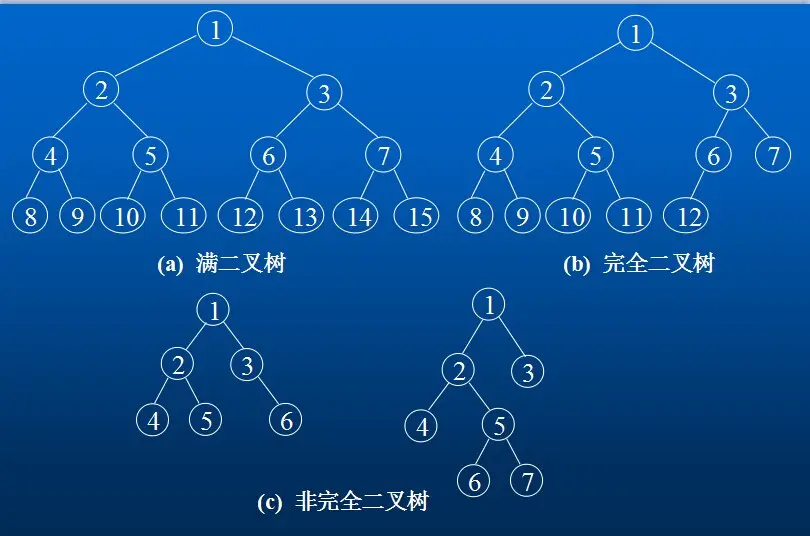
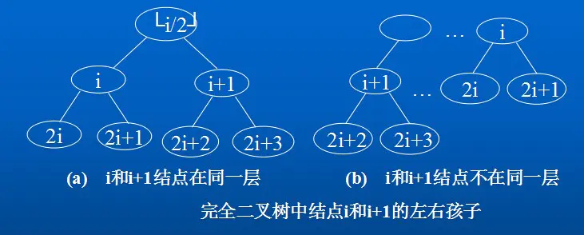
- 二叉树有深度遍历和广度遍历， 深度遍历有前序、 中序和后序三种遍历方法（非递归遍历（利用栈：将遍历到的结点都依次存入栈中，拿结果时从栈中访问））
- 广度遍历：按照层次一层层遍历;广度优先遍历二叉树(层序遍历)是用队列来实现的，广度遍历是从二叉树的根结点开始，自上而下逐层遍历；在同一层中，按照从左到右的顺序对结点逐一访问
- 二叉树的遍历要使用到栈和队列还有递归等
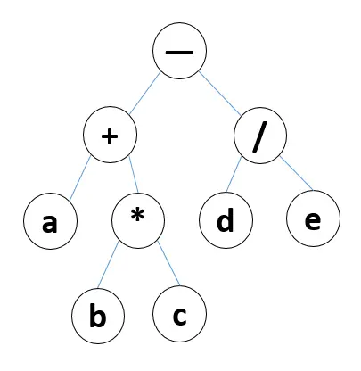
- 前序遍历：- + a * b c / d e
- 中序遍历：a + b * c - d / e
- 后序遍历：a b c + d e / -
- 广度遍历：- + / a * d e b c


#### [数据库事务特性，以及为什么要用事务(保证数据的一致性和完整性,避免异常和错误等导致的数据信息异常)](https://www.cnblogs.com/fjdingsd/p/5273008.html)
- 原子性（原子性是指事务包含的所有操作要么全部成功，要么全部失败回滚）
- 一致性，一致性是指事务必须使数据库从一个一致性状态变换到另一个一致性状态，也就是说一个事务执行之前和执行之后都必须处于一致性状态。拿转账来说，假设用户A和用户B两者的钱加起来一共是5000，那么不管A和B之间如何转账，转几次账，事务结束后两个用户的钱相加起来应该还得是5000，这就是事务的一致性。
- 隔离性，隔离性是当多个用户并发访问数据库时，比如操作同一张表时，数据库为每一个用户开启的事务，不能被其他事务的操作所干扰，多个并发事务之间要相互隔离
- 持久性，持久性是指一个事务一旦被提交了，那么对数据库中的数据的改变就是永久性的，即便是在数据库系统遇到故障的情况下也不会丢失提交事务的操作

#### [发布订阅设计模式，观察者模式，两者的区别](https://www.cnblogs.com/lovesong/p/5272752.html)


#### 网站搭建流程
- 万网域名注册
- 购买服务器/主机空间
- 网站域名的备案
- 使用xftp网站程序的上传
- 网站域名的解析
  - 通过域名后台管理，找到域名解析，然后找到解析记录的对应编辑栏。
- 安装安全证书
- 查看网站是否可以正常访问
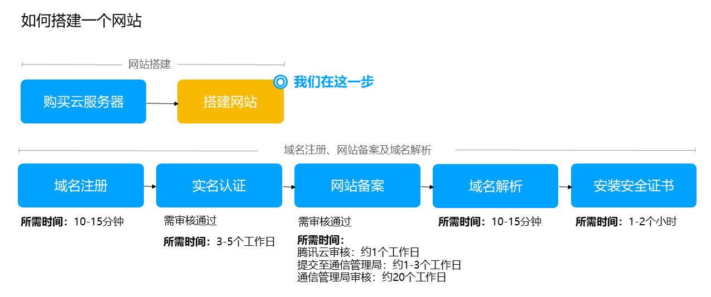

#### linux修改权限
- 命令格式：chmod {u|g|o|a}{+|-|=}{r|w|x} filename， 也可以使用八进制数字法
  - u (user)   表示用户本人。 
  - g (group)  表示同组用户。 
  - o (oher)   表示其他用户。 
  - a (all)    表示所有用户。 
  - +用于给予指定用户的许可权限。 
  - -用于取消指定用户的许可权限。 
  - =将所许可的权限赋给文件。 
  - r (read)   读许可，表示可以拷贝该文件或目录的内容。 
  - w (write)  写许可，表示可以修改该文件或目录的内容。 
  - x (execute)执行许可，表示可以执行该文件或进入目录。

#### html meta viewport原理
- 移动版的 Safari 浏览器最新引进了 viewport 这个 meta tag，让网页开发者来控制 viewport 的大小和缩放，其他手机浏览器也基本支持
- layout viewport比可视窗口大，所以pc端的页面也能正常显示，document.documentElement.clientWidth可获取其值
- visual viewport，ayout viewport的宽度是大于浏览器可视区域的宽度的，所以还需要一个viewport来代表浏览器可视区域的大小，这个viewport叫做 visual viewport。visual viewport的宽度可以通过 document.documentElement.innerWidth来获取。
- ideal viewport是一个能完美适配移动设备的viewport，ideal viewport并没有一个固定的尺寸，不同的设备有不同的ideal viewport。例如，所有的iphone的ideal viewport宽度都是320px，无论它的屏幕宽度是320还是640。ideal viewport 的意义在于，无论在何种分辨率的屏幕下，针对ideal viewport 而设计的网站，

#### jQuery和react使用场景
- jquery封装了选择器查找，dom操作，事件操作，ajax操作，动画，css及一些util方法和函数操作
- 非模块化，不想react等框架是组件式开发
- react有虚拟dom，通过json对象描述ui，为跨端提供了可能，react-native，而jquery做不到
- react不需要关注dom操作，数据驱动ui，加上模块化管理，特别适合大型系统
- 组件化开发，松耦合，高复用，类似webcomponent，jquery经常会出现耦合代码，比如依赖外部变量，或者同时操作一个变量或者dom元素

#### 直播点赞按钮的冒泡功能如何实现
```html
<p id = "demo"></p>
<input type = "button" id = "btn1" value = "点个赞吧" />
<script>
  document.ready(function () {
    $("#btn1").click(function () {
      // 1. 首先给按钮绑定点击事件。
      //2. 生成彩色的心，即随机选择图片。
      // 2.1 生成随机数
      var num = Math.floor(Math.random() * 3 + 1);
      //2.2 生成一个img元素，并为其添加src属性
      var image = $("");
      //三个图片的名字分别是 1.png\2.png\3.png,所以img的路径和图片名可以进行线面的字符串拼接
      image.attr("src", "./images/" + num + ".png");
      //3。将生成的img追加到页面上
      $("#demo").append(image);
      //4. 下来就是让心动起来。从点击按钮的地方向上飘。利用jquery的动画函数animate()
      //生成随机的距离左边的距离，这样就可以使心有种向上飘的感觉
      var left = Math.random() * 800;
      image.animate(
        {
          bottom: "800px",
          left: left,
          opacity: "0",
        },
        3000
      );
    });
  });
</script>
```

#### js的uglify如何实现
首先通过parse方法构建语法树，然后通过TreeTransformer遍历语法树，当遇到节点属于UglifyJS.AST_Number类型（所有的AST类型见ast）,这个token具有一个属性 value 保存着数字类型的具体值，我们将其改成16进制表示，然后 return node 就会用新的节点代替原来的节点。
```javascript
var UglifyJS = require("uglify-js");
var code = "var a = 1;";
var toplevel = UglifyJS.parse(code); //toplevel就是语法树
var transformer = new UglifyJS.TreeTransformer(function (node) {
  if (node instanceof UglifyJS.AST_Number) { //查找需要修改的叶子节点
        node.value = '0x' + Number(node.value).toString(16);
        return node; //返回一个新的叶子节点 替换原来的叶子节点
    };
});
toplevel.transform(transformer);  //遍历AST树
var ncode = toplevel.print_to_string(); //从AST还原成字符串
console.log(ncode); // var a = 0x1;
```


#### http请求发送到后台之后，后台做了什么
- 请求方法的判断
- url路径解析，路由解析
- url中查询字符串的解析
- cookie的解析
- basic认证
- 表单数据的解析
- 任意格式文件的上传处理
- 返回相应的数据或者模版html给页面

#### webpack的loader本身是一个函数，接受源文件作为参数，返回转换的结果，loaders从右向左执行，而plugin是对bundle文件的优化，资源管理和环境变量的注入，作用于整个构建过程，比如构建前清理目录（cleanwebpackplugin），拷贝文件(copywebpackplugin),htmlwebpackplugin(创建首页html)等等，所以写自定义的plugin时，其实插件就是编译器的钩子，plugin可以拿到编译器的上下文，这样plugin就可以自定义的去做一些事情
- 通过配置找到入口模块
- 读取文件分析模块依赖
- 针对不同的模块使用相应的loader
  - 比如es6-》es5会生成抽象语法树ast，修改语法树变成es5
- 整个时期都可以使用plugin
- 生成bundle.js文件

#### 当客户端向服务器请求一个静态页面或者一张图片时，服务器可以很清楚的知道内容大小，然后通过Content-Length消息首部字段告诉客户端需要接收多少数据。但是如果是动态页面等时，服务器是不可能预先知道内容大小，这时就可以使用Transfer-Encoding：chunk模式来传输数据了。即如果要一边产生数据，一边发给客户端，服务器就需要使用"Transfer-Encoding: chunked"这样的方式来代替Content-Length。chunk格式：[chunk size][\r\n][chunk data][\r\n][chunk size][\r\n][chunk data][\r\n][chunk size = 0][\r\n][\r\n]
