#### 单链表插入，单链表删除
- 单链表头部插入
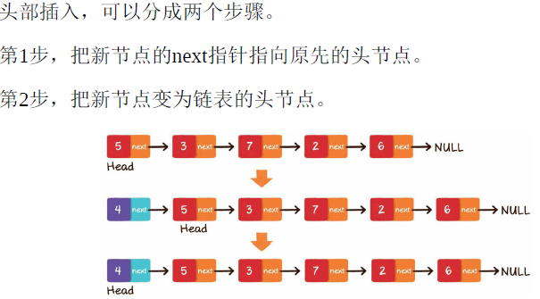
- 单链表尾部插入
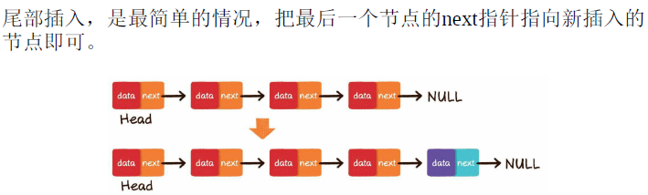
- 单链表中间插入
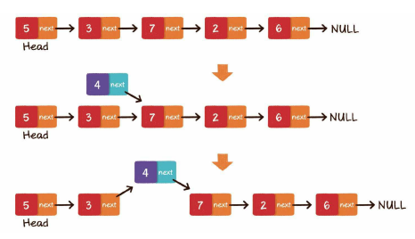
- 单链表头部删除
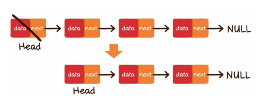
- 单链表尾部删除
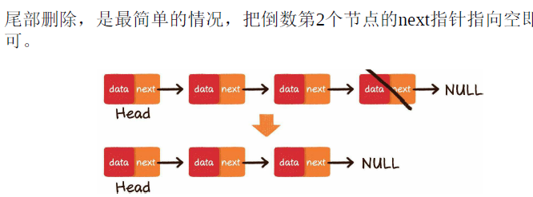
- 单链表中间删除
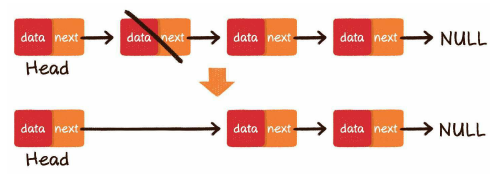

#### 数组和链表复杂度，优缺点
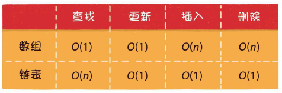
- 数组的优势在于能够快速定位元素，对于读操作多、写操作少的场景来说，用数组更合适一些。
- 相反地，链表的优势在于能够灵活地进行插入和删除操作（忽略了查找过程，因为就是一个简单的索引遍历），如果需要在尾部频繁插入、删除元素，用链表更合适一些。

#### 数据结构分类
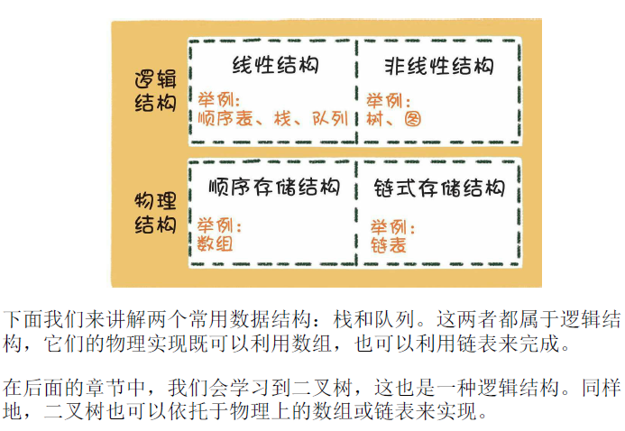

#### 栈
- 栈的输出顺序和输入顺序相反，所以栈通常用于对“历史”的回溯，也就是逆流而上追溯“历史”。

#### 队列
- 队列的输出顺序和输入顺序相同，所以队列通常用于对“历史”的回放，也就是按照“历史”顺序，把“历史”重演一遍。
- 例如在多线程中，争夺公平锁的等待队列，就是按照访问顺序来决定线程在队列中的次序的。
- 再如网络爬虫实现网站抓取时，也是把待抓取的网站URL存入队列中，再按照存入队列的顺序来依次抓取和解析的。

#### 双端队列
- 双端队列这种数据结构，可以说综合了栈和队列的优点，对双端队列来说，从队头一端可以入队或出队，从队尾一端也可以入队或出队。

#### 优先队列
- 还有一种队列，它遵循的不是先入先出，而是谁的优先级最高，谁先出队。
- 优先队列已经不属于线性数据结构的范畴了，它是基于二叉堆来实现

#### 散列表，hash表
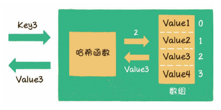
- 散列表也叫作哈希表 （hash table），这种数据结构提供了键（Key）和值（Value） 的映射关系。只要给出一个Key，就可以高效查找到它所匹配的Value，时间复杂度接近于O(1) 。

#### 计数排序，它适用于一定范围内的整数排序(一定范围并且整数)。时间复杂度O(n+m),空间Om,在取值范围不是很大的情况下，它的性能甚至快过那些时间复杂度为O(nlogn)的排序。
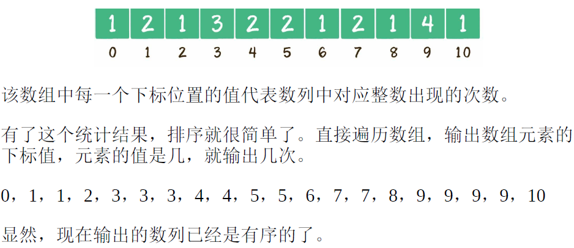

#### 桶排序
- 具体需要建立多少个桶，如何确定桶的区间范围，有很多种不同的方式。我们这里创建的桶数量等于原始数列的元素数量，除最后一个桶只包含数列最大值外，前面各个桶的区间按照比例来确定。
- 区间跨度 = （最大值-最小值）/ （桶的数量 - 1）
- 适合差异不大的数组元素，时间复杂度和空间复杂度都是On
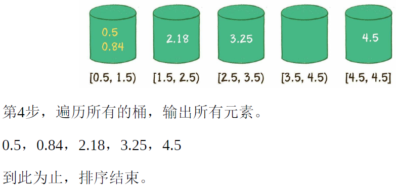

